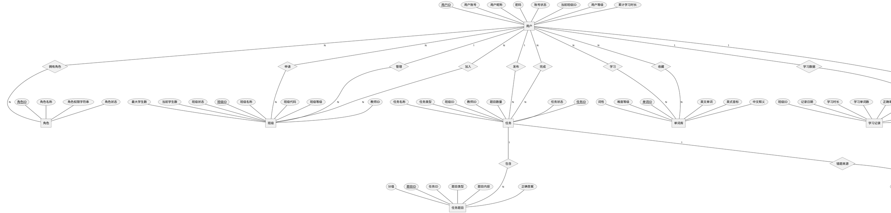

# 英语学习系统 ER 图实体属性与关系说明

## 一、实体属性说明

### 1. 用户表（sys_user）

| 属性名 | 中文名称 | 数据类型 | 说明 |
|--------|----------|----------|------|
| user_id | 用户ID | BIGINT | 主键，唯一标识一个用户 |
| user_name | 用户账号 | VARCHAR | 登录账号，唯一 |
| nick_name | 用户昵称 | VARCHAR | 显示名称 |
| password | 密码 | VARCHAR | 加密存储的登录密码 |
| status | 账号状态 | CHAR | 0-正常，1-停用 |
| current_class_id | 当前班级ID | BIGINT | 学生当前所在班级，外键关联班级表 |
| user_level | 用户等级 | INT | 学习等级 |
| total_study_time | 累计学习时长 | INT | 单位：秒 |

### 2. 角色表（sys_role）

| 属性名 | 中文名称 | 数据类型 | 说明 |
|--------|----------|----------|------|
| role_id | 角色ID | BIGINT | 主键，唯一标识一个角色 |
| role_name | 角色名称 | VARCHAR | 如：学生、老师、管理员 |
| role_key | 角色权限字符串 | VARCHAR | 如：student、teacher、admin |
| status | 角色状态 | CHAR | 0-正常，1-停用 |

### 3. 班级表（elia_class）

| 属性名 | 中文名称 | 数据类型 | 说明 |
|--------|----------|----------|------|
| class_id | 班级ID | BIGINT | 主键，唯一标识一个班级 |
| class_name | 班级名称 | VARCHAR | 如：高一(1)班 |
| class_code | 班级代码 | VARCHAR | 唯一编码，系统自动生成 |
| class_level | 班级等级 | CHAR | A/B/C/D 四个等级 |
| teacher_id | 教师ID | BIGINT | 外键，关联用户表中角色为老师的用户 |
| max_students | 最大学生数 | INT | 班级容量上限（30-50） |
| current_students | 当前学生数 | INT | 冗余计数字段，与班级成员表保持一致 |
| class_status | 班级状态 | CHAR | 0-正常，1-停用 |

### 4. 任务表（elia_task）

| 属性名 | 中文名称 | 数据类型 | 说明 |
|--------|----------|----------|------|
| task_id | 任务ID | BIGINT | 主键，唯一标识一个任务 |
| task_name | 任务名称 | VARCHAR | 如：第三单元单词学习 |
| task_type | 任务类型 | CHAR | 单词学习、阅读理解、听力练习等 |
| class_id | 班级ID | BIGINT | 外键，任务所属班级 |
| teacher_id | 教师ID | BIGINT | 外键，任务创建者（老师） |
| question_count | 题目数量 | INT | 任务包含的题目总数 |
| task_status | 任务状态 | CHAR | 待发布、进行中、已结束等 |

### 5. 任务题目表（elia_task_question）

| 属性名 | 中文名称 | 数据类型 | 说明 |
|--------|----------|----------|------|
| question_id | 题目ID | BIGINT | 主键，唯一标识一道题目 |
| task_id | 任务ID | BIGINT | 外键，题目所属任务 |
| question_type | 题目类型 | CHAR | 选择题、填空题、单词拼写等 |
| question_content | 题目内容 | TEXT | 题目的完整描述 |
| correct_answer | 正确答案 | TEXT | 标准答案 |
| score | 分值 | DECIMAL | 该题目的分值 |

### 6. 单词库（elia_word_library）

| 属性名 | 中文名称 | 数据类型 | 说明 |
|--------|----------|----------|------|
| word_id | 单词ID | BIGINT | 主键，唯一标识一个单词 |
| english_word | 英文单词 | VARCHAR | 单词拼写 |
| phonetic_uk | 英式音标 | VARCHAR | 英式发音音标 |
| chinese_meaning | 中文释义 | VARCHAR | 单词的中文翻译 |
| word_type | 词性 | VARCHAR | 名词、动词、形容词等 |
| difficulty_level | 难度等级 | INT | 1-5，数字越大越难 |

### 7. 错题记录表（elia_wrong_question）

| 属性名 | 中文名称 | 数据类型 | 说明 |
|--------|----------|----------|------|
| wrong_id | 错题ID | BIGINT | 主键，唯一标识一条错题记录 |
| user_id | 用户ID | BIGINT | 外键，产生错题的学生 |
| task_id | 任务ID | BIGINT | 外键，错题来源的任务 |
| question_id | 题目ID | BIGINT | 外键，对应的原始题目 |
| class_id | 班级ID | BIGINT | 外键，产生错题时所在的班级 |
| correct_answer | 正确答案 | TEXT | 该题目的标准答案 |
| student_answer | 学生答案 | TEXT | 学生提交的错误答案 |
| wrong_count | 错误次数 | INT | 该题目累计答错的次数 |
| is_mastered | 是否已掌握 | CHAR | 0-未掌握，1-已掌握 |

### 8. 学习记录表（elia_learning_record）

| 属性名 | 中文名称 | 数据类型 | 说明 |
|--------|----------|----------|------|
| record_id | 记录ID | BIGINT | 主键，唯一标识一条学习记录 |
| user_id | 用户ID | BIGINT | 外键，学习记录所属学生 |
| class_id | 班级ID | BIGINT | 外键，学习时所在的班级 |
| record_date | 记录日期 | DATE | 学习发生的日期 |
| study_duration | 学习时长 | INT | 单位：秒 |
| words_studied | 学习单词数 | INT | 当日学习的单词数量 |
| correct_rate | 正确率 | DECIMAL | 当日学习的正确率（百分比） |

---

## 二、实体关系说明

### 1. 用户 ↔ 角色（多对多）

一个用户可以拥有多个角色，一个角色可以分配给多个用户。通过用户角色关联表（sys_user_role）实现多对多关系。系统中有三种角色：学生、老师、管理员。

### 2. 用户（教师）→ 班级（一对多）

一个老师可以创建并管理多个班级，每个班级只属于一个老师。通过班级表中的 teacher_id 字段关联到用户表的 user_id。

### 3. 用户（学生）↔ 班级（多对多）

一个学生可以加入班级（同一时间只能在一个班级中处于正常状态，但历史上可以有多条成员记录），一个班级可以包含多个学生。通过班级成员表（elia_class_member）实现多对多关系。

### 4. 用户（学生）↔ 班级 — 申请关系（多对多）

学生可以向班级提交入班、换班、退班申请。一个学生可以提交多次申请，一个班级可以收到多个申请。通过班级申请记录表（elia_class_application）实现。

### 5. 用户（教师）→ 任务（一对多）

一个老师可以创建多个学习任务，每个任务由一个老师创建。通过任务表中的 teacher_id 字段关联。

### 6. 班级 → 任务（一对多）

一个班级可以被布置多个任务，每个任务属于一个班级。通过任务表中的 class_id 字段关联。

### 7. 用户（学生）↔ 任务（多对多）

一个学生可以完成多个任务，一个任务可以被多个学生完成。通过学生任务记录表（elia_student_task）实现多对多关系。

### 8. 任务 → 任务题目（一对多，组合关系）

一个任务包含多道题目，每道题目只属于一个任务。题目依赖任务存在，任务删除时题目也应删除。通过任务题目表中的 task_id 字段关联。

### 9. 用户（学生）↔ 单词库 — 学习关系（多对多）

一个学生可以学习多个单词，一个单词可以被多个学生学习。通过用户单词学习记录表（elia_user_word_record）实现，记录学习次数、正确次数、掌握程度等。

### 10. 用户（学生）↔ 单词库 — 收藏关系（多对多）

一个学生可以收藏多个单词，一个单词可以被多个学生收藏。通过单词收藏表（elia_word_collection）实现，记录收藏分组、标签、笔记等。

### 11. 用户（学生）→ 错题记录（一对多）

一个学生可以产生多条错题记录，每条错题记录属于一个学生。通过错题记录表中的 user_id 字段关联。

### 12. 任务 → 错题记录（一对多）

一个任务可以产生多条错题记录，每条错题记录来源于一个任务。通过错题记录表中的 task_id 字段关联。

### 13. 用户（学生）→ 学习记录（一对多）

一个学生拥有多条学习记录，每条学习记录属于一个学生。通过学习记录表中的 user_id 字段关联。

### 14. 班级 → 学习记录（一对多）

一个班级下可以产生多条学习记录，每条学习记录关联一个班级。通过学习记录表中的 class_id 字段关联。

---

## 三、关系汇总表

| 序号 | 实体A | 关系类型 | 实体B | 关系描述 | 实现方式 |
|------|-------|----------|-------|----------|----------|
| 1 | 用户 | 多对多 | 角色 | 用户拥有角色 | sys_user_role 关联表 |
| 2 | 用户（教师） | 一对多 | 班级 | 老师管理班级 | elia_class.teacher_id |
| 3 | 用户（学生） | 多对多 | 班级 | 学生加入班级 | elia_class_member 关联表 |
| 4 | 用户（学生） | 多对多 | 班级 | 学生申请班级 | elia_class_application 关联表 |
| 5 | 用户（教师） | 一对多 | 任务 | 老师发布任务 | elia_task.teacher_id |
| 6 | 班级 | 一对多 | 任务 | 班级包含任务 | elia_task.class_id |
| 7 | 用户（学生） | 多对多 | 任务 | 学生完成任务 | elia_student_task 关联表 |
| 8 | 任务 | 一对多 | 任务题目 | 任务包含题目 | elia_task_question.task_id |
| 9 | 用户（学生） | 多对多 | 单词库 | 学生学习单词 | elia_user_word_record 关联表 |
| 10 | 用户（学生） | 多对多 | 单词库 | 学生收藏单词 | elia_word_collection 关联表 |
| 11 | 用户（学生） | 一对多 | 错题记录 | 学生产生错题 | elia_wrong_question.user_id |
| 12 | 任务 | 一对多 | 错题记录 | 任务产生错题 | elia_wrong_question.task_id |
| 13 | 用户（学生） | 一对多 | 学习记录 | 学生学习数据 | elia_learning_record.user_id |
| 14 | 班级 | 一对多 | 学习记录 | 班级学习数据 | elia_learning_record.class_id |

---

## 四、ER 图（PlantUML Chen 记法）

---

## 五、E-R 图转换为关系模型

1）用户表（sys_user）：包含用户ID（唯一标识）、用户账号、用户昵称、密码、账号状态、当前班级ID、用户等级、累计学习时长等字段，用于存储系统中所有用户（学生、老师、管理员）的基本信息和学习概况数据。

2）角色表（sys_role）：包含角色ID（唯一标识）、角色名称、角色权限字符串、角色状态等字段，用于定义系统中的角色类型（学生、老师、管理员），实现基于角色的权限控制。

3）用户角色关联表（sys_user_role）：包含用户ID、角色ID等字段，作为用户与角色之间多对多关系的中间表，记录每个用户所拥有的角色，一个用户可以拥有多个角色，一个角色也可以分配给多个用户。

4）班级表（elia_class）：包含班级ID（唯一标识）、班级名称、班级代码、班级等级、教师ID、最大学生数、当前学生数、班级状态等字段，用于记录和管理班级的基本信息。其中教师ID为外键，关联用户表，表示一个老师可以管理多个班级，每个班级只属于一个老师。

5）班级成员表（elia_class_member）：包含成员ID（唯一标识）、班级ID、用户ID、加入时间、成员角色、是否首次加入、已完成任务数、累计学习时长、掌握单词数、班级排名、成员状态、最后活跃时间等字段，作为用户与班级之间多对多关系的中间表，记录学生在班级中的成员身份和学习数据。

6）班级申请记录表（elia_class_application）：包含申请ID（唯一标识）、申请人ID、班级ID、申请类型、原班级ID、申请理由、申请时间、申请状态、审核时间、审核人ID、审核备注等字段，作为用户与班级之间申请关系的中间表，记录学生入班、换班、退班申请的全生命周期信息。

7）任务表（elia_task）：包含任务ID（唯一标识）、任务名称、任务类型、班级ID、教师ID、题目数量、任务状态等字段，用于存储老师为班级发布的学习任务信息。其中教师ID和班级ID均为外键，分别关联用户表和班级表，表示一个老师可以发布多个任务，一个班级可以包含多个任务。

8）任务题目表（elia_task_question）：包含题目ID（唯一标识）、任务ID、题目类型、题目内容、正确答案、分值等字段，用于存储每个任务中包含的具体题目信息。其中任务ID为外键，关联任务表，表示一个任务包含多道题目，题目依赖任务存在，属于组合关系。

9）学生任务记录表（elia_student_task）：包含记录ID（唯一标识）、用户ID、任务ID、班级ID、总得分、正确题数、错误题数、任务状态、是否通过等字段，作为用户与任务之间多对多关系的中间表，记录每个学生完成每个任务的详细成绩和状态。

10）单词库（elia_word_library）：包含单词ID（唯一标识）、英文单词、英式音标、中文释义、词性、难度等级等字段，用于存储系统中所有可供学习的英语单词基础数据。

11）用户单词学习记录表（elia_user_word_record）：包含记录ID（唯一标识）、用户ID、单词ID、学习次数、正确次数、错误次数、掌握程度、是否已掌握等字段，作为用户与单词库之间学习关系的中间表，记录每个学生对每个单词的学习进度和掌握情况。

12）单词收藏表（elia_word_collection）：包含收藏ID（唯一标识）、用户ID、单词ID、收藏分组、标签、笔记等字段，作为用户与单词库之间收藏关系的中间表，记录学生收藏的单词及个人学习笔记。

13）错题记录表（elia_wrong_question）：包含错题ID（唯一标识）、用户ID、任务ID、题目ID、班级ID、正确答案、学生答案、错误次数、是否已掌握等字段，用于记录学生在完成任务过程中答错的题目信息。其中用户ID、任务ID、题目ID、班级ID均为外键，分别关联用户表、任务表、任务题目表和班级表。

14）学习记录表（elia_learning_record）：包含记录ID（唯一标识）、用户ID、班级ID、记录日期、学习时长、学习单词数、正确率等字段，用于记录学生每日的学习行为数据。其中用户ID和班级ID为外键，分别关联用户表和班级表，表示一个学生拥有多条学习记录，一个班级下可以产生多条学习记录。
