# 英语学习系统业务流程说明文档

## 文档概述

本文档详细说明英语学习系统的8个主要业务场景，包括涉及的角色、交互流程、数据流转和活动图绘制方法。

---

## 目录

1. [班级申请与审批流程](#1-班级申请与审批流程)
2. [学习任务发布与完成反馈](#2-学习任务发布与完成反馈)
3. [错题管理与复习指导](#3-错题管理与复习指导)
4. [用户账号管理](#4-用户账号管理)
5. [班级创建与分配](#5-班级创建与分配)
6. [学习进度跟踪与评估](#6-学习进度跟踪与评估)
7. [教师工作量统计与考核](#7-教师工作量统计与考核)
8. [单词收藏与个性化学习](#8-单词收藏与个性化学习)
9. [活动图绘制指南](#活动图绘制指南)

---

## 1. 班级申请与审批流程

### 涉及角色
- **学生**：发起换班申请
- **管理员**：审核申请
- **老师**：接收新学生通知

### 业务场景描述
学生因学习需求或其他原因需要更换班级时，通过系统提交申请，由管理员审核后完成班级变更。

### 详细交互流程

#### 阶段1：学生发起申请
1. 学生登录系统
2. 进入"换班申请"页面（`/student/change-class`）
3. 浏览可申请的班级列表
4. 选择目标班级
5. 填写申请理由
6. 提交申请

**数据流转：**
```
学生端 → API: POST /api/class/apply
{
  studentId: "S001",
  currentClassId: "C001",
  targetClassId: "C002",
  reason: "希望加入更适合的班级"
}
```


#### 阶段2：管理员审核
1. 管理员收到申请通知（系统消息/邮件）
2. 进入"班级管理"页面（`/admin/class-management`）
3. 查看待审核申请列表
4. 查看申请详情（学生信息、当前班级、目标班级、申请理由）
5. 做出决策：
   - **批准**：确认班级变更
   - **拒绝**：填写拒绝理由

**数据流转：**
```
管理员端 → API: PUT /api/class/apply/:id/review
{
  applyId: "A001",
  status: "approved" | "rejected",
  reviewNote: "批准/拒绝理由",
  reviewerId: "ADMIN001"
}
```

#### 阶段3：系统处理与通知
**如果批准：**
1. 系统更新学生班级信息
2. 从原班级移除学生
3. 添加学生到新班级
4. 发送通知给：
   - 学生：申请已批准
   - 原班级老师：学生已离开
   - 新班级老师：新学生加入

**如果拒绝：**
1. 更新申请状态为已拒绝
2. 发送拒绝通知给学生
3. 学生可查看拒绝理由并重新申请

#### 阶段4：老师接收通知
1. 新班级老师收到通知
2. 查看新学生基本信息
3. 查看学生历史学习数据
4. 为学生分配初始学习任务

### 关键数据实体
```javascript
// 申请记录
{
  id: "A001",
  studentId: "S001",
  studentName: "张三",
  currentClassId: "C001",
  targetClassId: "C002",
  reason: "申请理由",
  status: "pending" | "approved" | "rejected",
  reviewerId: "ADMIN001",
  reviewNote: "审核意见",
  createdAt: "2026-02-19T10:00:00Z",
  reviewedAt: "2026-02-19T14:00:00Z"
}
```

### 异常处理
- 目标班级已满员 → 提示选择其他班级
- 重复申请 → 提示已有待审核申请
- 申请被拒绝后 → 7天内不可再次申请同一班级


### 活动图（PlantUML）

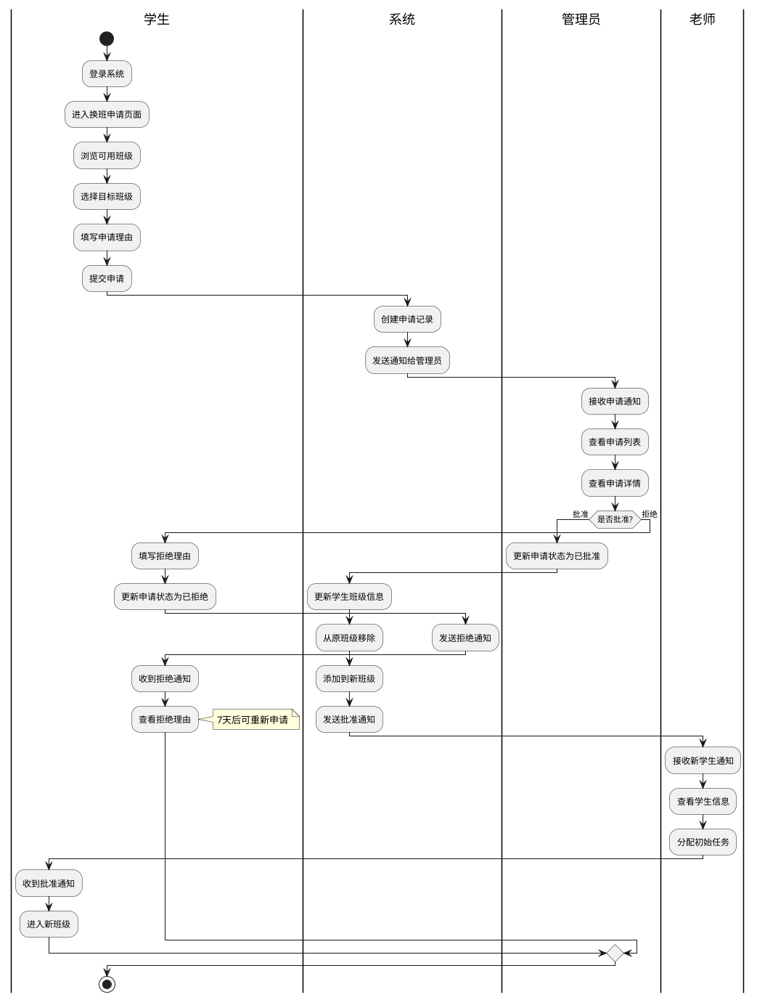

---

## 2. 学习任务发布与完成反馈

### 涉及角色
- **老师**：创建和发布学习任务
- **学生**：接收并完成任务

### 业务场景描述
老师根据教学计划为班级或个别学生创建学习任务，学生完成后老师查看完成情况并给予反馈。

### 详细交互流程

#### 阶段1：老师创建任务
1. 老师登录系统
2. 进入"任务管理"页面（`/teacher/task-management`）
3. 点击"创建新任务"
4. 填写任务信息：
   - 任务名称
   - 任务类型（单词学习、阅读理解、听力练习等）
   - 任务内容（单词列表、文章链接等）
   - 目标对象（整个班级）
   - 截止时间
6. 发布任务

**数据流转：**
```
老师端 → API: POST /api/tasks
{
  teacherId: "T001",
  title: "第三单元单词学习",
  type: "word_learning",
  content: {
    wordListId: "WL003",
    wordCount: 50
  },
  targetType: "class" | "students",
  targetIds: ["C001"] | ["S001", "S002"],
  deadline: "2026-02-26T23:59:59Z",
  requirements: {
    minStudyTimes: 3,
    minAccuracy: 80
  }
}
```


#### 阶段2：学生接收任务
1. 学生登录系统
2. 首页显示待完成任务数量
3. 进入"我的任务"页面（`/student/my-tasks`）
4. 查看任务列表（待完成/进行中/已完成）
5. 点击任务查看详情
6. 开始学习任务

#### 阶段3：学生完成任务
1. 进入学习界面（如 `/student/word-learn`）
2. 系统加载任务相关内容
3. 学生进行学习：
   - 查看单词释义
   - 进行拼写练习
   - 完成测试题
4. 系统实时记录学习数据：
   - 学习时长
   - 学习次数
   - 正确率
   - 错误单词
5. 达到任务要求后自动标记为已完成

**数据流转：**
```
学生端 → API: POST /api/tasks/:id/progress
{
  taskId: "TASK001",
  studentId: "S001",
  progress: {
    studyTimes: 3,
    accuracy: 85,
    timeSpent: 1800, // 秒
    completedWords: 50,
    errorWords: ["abandon", "ability"]
  },
  status: "completed"
}
```

#### 阶段4：老师查看与反馈
1. 老师进入"任务管理"页面
2. 查看任务完成统计：
   - 已完成人数/总人数
   - 平均正确率
   - 平均学习时长
3. 查看个别学生完成详情
4. 针对性给予反馈：
   - 表扬优秀学生
   - 提醒未完成学生
   - 为错误率高的学生布置复习任务

**数据流转：**
```
老师端 → API: POST /api/tasks/:id/feedback
{
  taskId: "TASK001",
  studentId: "S001",
  feedback: "完成得很好，继续保持！",
  rating: 5,
  teacherId: "T001"
}
```

#### 阶段5：学生查看反馈
1. 学生收到反馈通知
2. 在任务详情页查看老师评价
3. 根据反馈调整学习策略

### 关键数据实体
```javascript
// 任务
{
  id: "TASK001",
  teacherId: "T001",
  title: "第三单元单词学习",
  type: "word_learning",
  content: { wordListId: "WL003" },
  targetType: "class",
  targetIds: ["C001"],
  deadline: "2026-02-26T23:59:59Z",
  requirements: { minStudyTimes: 3, minAccuracy: 80 },
  status: "active",
  createdAt: "2026-02-19T10:00:00Z"
}

// 任务进度
{
  id: "TP001",
  taskId: "TASK001",
  studentId: "S001",
  progress: {
    studyTimes: 3,
    accuracy: 85,
    timeSpent: 1800,
    completedWords: 50
  },
  status: "completed",
  completedAt: "2026-02-20T15:30:00Z"
}
```

### 异常处理
- 任务过期未完成 → 标记为逾期，仍可继续完成
- 学生多次未完成任务 → 系统提醒老师关注
- 班级整体完成率低 → 提示老师调整任务难度


### 活动图（Mermaid）

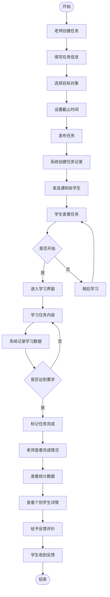

---

## 3. 错题管理与复习指导

### 涉及角色
- **学生**：产生错题、进行复习
- **老师**：查看错题分析、布置复习任务

### 业务场景描述
学生在学习过程中产生的错题被系统自动收集，老师可以查看学生的错题情况并针对性布置复习任务。

### 详细交互流程

#### 阶段1：错题自动收集
1. 学生在学习过程中答错题目
2. 系统自动记录错题信息：
   - 错误的单词/题目
   - 学生的错误答案
   - 正确答案
   - 错误时间
   - 错误次数
3. 添加到学生的错题本

**数据流转：**
```
学习模块 → API: POST /api/errors
{
  studentId: "S001",
  wordId: "W001",
  word: "abandon",
  studentAnswer: "abendon",
  correctAnswer: "abandon",
  errorType: "spelling",
  context: "任务学习",
  taskId: "TASK001"
}
```

#### 阶段2：学生查看错题本
1. 学生进入"我的错题"页面（`/student/my-errors`）
2. 查看错题列表（按时间/按单词/按错误次数排序）
3. 查看错题详情：
   - 单词释义
   - 例句
   - 错误记录
   - 掌握程度
4. 可以进行错题复习

#### 阶段3：老师查看错题分析
1. 老师进入"错题管理"页面（`/teacher/error-management`）
2. 查看班级错题统计：
   - 高频错词排行
   - 学生错题数量排行
   - 错题类型分布
3. 查看个别学生错题详情
4. 分析错题原因：
   - 拼写问题
   - 词义混淆
   - 语法错误


#### 阶段4：老师布置复习任务
1. 老师根据错题分析结果
2. 为学生创建针对性复习任务：
   - 错题专项复习
   - 易混淆词汇对比
   - 强化练习
3. 设置复习要求和截止时间
4. 发布复习任务

**数据流转：**
```
老师端 → API: POST /api/tasks
{
  teacherId: "T001",
  title: "错题复习任务",
  type: "error_review",
  content: {
    errorWordIds: ["W001", "W005", "W012"],
    reviewType: "intensive"
  },
  targetType: "students",
  targetIds: ["S001"],
  deadline: "2026-02-23T23:59:59Z",
  requirements: {
    minStudyTimes: 5,
    minAccuracy: 90
  }
}
```

#### 阶段5：学生复习错题
1. 学生收到复习任务通知
2. 进入错题复习模式
3. 系统重点展示错题内容
4. 完成复习练习
5. 系统更新错题掌握状态

#### 阶段6：效果跟踪
1. 老师查看复习任务完成情况
2. 对比复习前后的正确率
3. 评估复习效果
4. 决定是否需要进一步强化

### 关键数据实体
```javascript
// 错题记录
{
  id: "E001",
  studentId: "S001",
  wordId: "W001",
  word: "abandon",
  studentAnswer: "abendon",
  correctAnswer: "abandon",
  errorType: "spelling",
  errorCount: 3,
  lastErrorAt: "2026-02-19T14:30:00Z",
  masteryLevel: "weak", // weak/medium/strong
  reviewedTimes: 2,
  lastReviewAt: "2026-02-20T10:00:00Z"
}
```

### 智能推荐机制
- 根据遗忘曲线自动推送复习提醒
- 错误次数多的单词优先复习
- 长时间未复习的错题重新提醒
- 相似易混淆单词组合复习

### 异常处理
- 错题过多（>100个）→ 建议分批复习
- 同一单词反复出错 → 标记为重点难词
- 长期未复习 → 系统自动提醒

### 活动图（PlantUML）

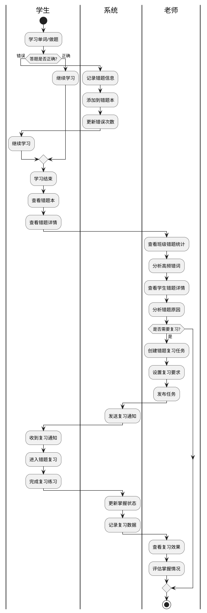

---

## 4. 用户账号管理

### 涉及角色
- **管理员**：管理所有用户账号
- **老师/学生**：被管理的用户

### 业务场景描述
管理员负责审核新用户注册、分配角色权限、管理用户信息和处理账号异常。


### 详细交互流程

#### 阶段1：用户注册
1. 用户访问注册页面（`/register`）
2. 填写注册信息：
   - 用户名
   - 密码
   - 真实姓名
   - 邮箱
   - 手机号
   - 申请角色（学生/老师）
3. 提交注册申请

**数据流转：**
```
注册页面 → API: POST /api/auth/register
{
  username: "zhangsan",
  password: "hashed_password",
  realName: "张三",
  email: "zhangsan@example.com",
  phone: "13800138000",
  requestedRole: "student" | "teacher"
}
```

#### 阶段2：管理员审核
1. 管理员登录系统
2. 进入"用户管理"页面（`/admin/user-management`）
3. 查看待审核用户列表
4. 查看用户详细信息
5. 验证用户身份（必要时联系确认）
6. 做出决策：
   - **批准**：分配角色和权限
   - **拒绝**：填写拒绝理由

**数据流转：**
```
管理员端 → API: PUT /api/users/:id/review
{
  userId: "U001",
  status: "approved" | "rejected",
  role: "student" | "teacher" | "admin",
  reviewNote: "审核意见",
  reviewerId: "ADMIN001"
}
```

#### 阶段3：账号激活
**如果批准：**
1. 系统激活用户账号
2. 分配默认权限
3. 发送激活通知邮件/短信
4. 用户可以正常登录

**如果拒绝：**
1. 发送拒绝通知
2. 用户可查看拒绝理由
3. 可修改信息后重新申请

#### 阶段4：用户信息管理
管理员可以进行以下操作：

**查看用户列表**
- 按角色筛选（学生/老师/管理员）
- 按状态筛选（待审核/正常/禁用）
- 搜索用户（姓名/用户名/邮箱）

**编辑用户信息**
- 修改基本信息
- 更改角色
- 调整权限

**重置密码**
- 为用户重置密码
- 发送新密码到邮箱

**禁用/启用账号**
- 临时禁用违规账号
- 重新启用账号

**删除账号**
- 删除测试账号
- 删除长期未使用账号

#### 阶段5：批量操作
1. 管理员可以批量导入用户
2. 使用Excel模板上传
3. 系统验证数据格式
4. 批量创建账号
5. 发送账号信息给用户

**数据流转：**
```
管理员端 → API: POST /api/users/batch-import
{
  users: [
    {
      username: "student001",
      realName: "学生1",
      email: "student001@example.com",
      role: "student",
      classId: "C001"
    },
    // ... 更多用户
  ]
}
```

### 关键数据实体
```javascript
// 用户
{
  id: "U001",
  username: "zhangsan",
  password: "hashed_password",
  realName: "张三",
  email: "zhangsan@example.com",
  phone: "13800138000",
  role: "student" | "teacher" | "admin",
  status: "pending" | "active" | "disabled",
  classId: "C001", // 学生专属
  createdAt: "2026-02-19T10:00:00Z",
  lastLoginAt: "2026-02-19T14:30:00Z"
}
```

### 权限控制
```javascript
// 角色权限
{
  student: [
    "view_own_tasks",
    "submit_homework",
    "view_own_progress",
    "apply_class_change"
  ],
  teacher: [
    "create_tasks",
    "view_class_data",
    "manage_students",
    "review_homework"
  ],
  admin: [
    "manage_users",
    "manage_classes",
    "view_all_data",
    "system_settings"
  ]
}
```

### 异常处理
- 用户名重复 → 提示更换用户名
- 邮箱已注册 → 提示使用其他邮箱或找回密码
- 批量导入数据错误 → 返回错误行号和原因
- 账号被禁用 → 登录时提示联系管理员


### 活动图（PlantUML）

```plantuml
@startuml 用户账号管理流程
|用户|
start
:访问注册页面;
:填写注册信息;
:选择申请角色;
:提交注册申请;

|系统|
:创建待审核账号;
:发送通知给管理员;

|管理员|
:登录系统;
:查看待审核列表;
:查看用户详情;
:验证用户身份;
if (是否批准?) then (批准)
  :分配角色和权限;
  
  |系统|
  :激活账号;
  :发送激活通知;
  
  |用户|
  :收到激活通知;
  :登录系统;
  :开始使用;
  
else (拒绝)
  :填写拒绝理由;
  
  |系统|
  :发送拒绝通知;
  
  |用户|
  :收到拒绝通知;
  :查看拒绝理由;
  :修改信息重新申请;
endif

note right of 管理员
  管理员还可以：
  - 编辑用户信息
  - 重置密码
  - 禁用/启用账号
  - 批量导入用户
end note

stop
@enduml
```

---

## 5. 班级创建与分配

### 涉及角色
- **管理员**：创建班级、分配班主任
- **老师**：接收班级管理权限
- **学生**：被分配到班级

### 业务场景描述
管理员创建新班级并分配班主任老师，然后将学生分配到相应班级，形成完整的教学组织结构。

### 详细交互流程

#### 阶段1：管理员创建班级
1. 管理员进入"班级管理"页面（`/admin/class-management`）
2. 点击"创建新班级"
3. 填写班级信息：
   - 班级名称
   - 班级编号
   - 年级
   - 学期
   - 班级容量
   - 班级描述
4. 选择班主任老师
5. 创建班级

**数据流转：**
```
管理员端 → API: POST /api/classes
{
  name: "高一(1)班",
  code: "C2026-01",
  grade: "高一",
  semester: "2026春季",
  capacity: 40,
  description: "重点班",
  teacherId: "T001",
  adminId: "ADMIN001"
}
```

#### 阶段2：系统通知班主任
1. 系统创建班级记录
2. 分配班主任权限
3. 发送通知给班主任老师
4. 老师收到班级分配通知

#### 阶段3：老师接收班级
1. 老师登录系统
2. 查看班级分配通知
3. 进入"我的班级"页面（`/teacher/my-classes`）
4. 查看班级基本信息
5. 确认接收班级管理权限

#### 阶段4：添加学生到班级
管理员或老师可以通过以下方式添加学生：

**方式1：手动添加**
1. 在班级详情页点击"添加学生"
2. 搜索或选择学生
3. 确认添加

**方式2：批量导入**
1. 下载学生导入模板
2. 填写学生信息
3. 上传Excel文件
4. 系统验证数据
5. 批量添加学生

**方式3：学生申请加入**
1. 学生浏览可加入班级
2. 提交加入申请
3. 管理员/老师审核
4. 批准后加入班级

**数据流转：**
```
管理员/老师端 → API: POST /api/classes/:id/students
{
  classId: "C001",
  studentIds: ["S001", "S002", "S003"],
  operatorId: "ADMIN001" | "T001"
}
```


#### 阶段5：学生接收通知
1. 学生收到班级加入通知
2. 进入"我的班级"页面（`/student/my-class`）
3. 查看班级信息：
   - 班级名称
   - 班主任信息
   - 班级成员
   - 班级公告
4. 开始班级学习

#### 阶段6：班级管理
老师可以进行以下班级管理操作：

**查看班级信息**
- 班级成员列表
- 学生学习数据
- 班级整体进度

**发布班级公告**
- 通知重要事项
- 发布学习资料

**管理班级成员**
- 移除学生
- 调整学生分组

**查看班级数据**
- 整体学习统计
- 任务完成情况
- 成绩分析

### 关键数据实体
```javascript
// 班级
{
  id: "C001",
  name: "高一(1)班",
  code: "C2026-01",
  grade: "高一",
  semester: "2026春季",
  capacity: 40,
  currentCount: 35,
  teacherId: "T001",
  teacherName: "李老师",
  status: "active",
  createdBy: "ADMIN001",
  createdAt: "2026-02-19T10:00:00Z"
}

// 班级成员
{
  id: "CM001",
  classId: "C001",
  studentId: "S001",
  studentName: "张三",
  joinedAt: "2026-02-19T14:00:00Z",
  status: "active"
}
```

### 班级状态管理
```javascript
// 班级状态
{
  active: "正常使用",
  archived: "已归档（学期结束）",
  suspended: "暂停使用"
}
```

### 异常处理
- 班级已满员 → 提示扩容或创建新班级
- 老师已有班级 → 确认是否接收多个班级
- 学生已在其他班级 → 提示是否转班
- 批量导入学生不存在 → 返回错误列表

### 活动图（PlantUML）

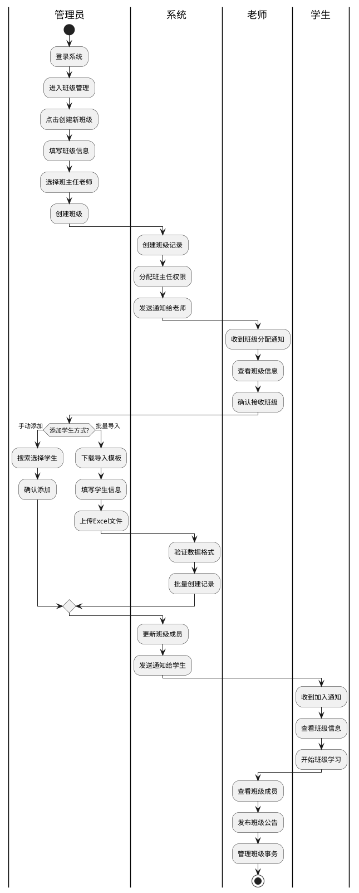

---

## 6. 学习进度跟踪与评估

### 涉及角色
- **学生**：进行学习活动
- **老师**：查看和评估学习进度

### 业务场景描述
系统实时记录学生的学习数据，老师可以查看班级和个人的学习进度，进行数据分析和教学调整。

### 详细交互流程

#### 阶段1：学生学习数据采集
学生在学习过程中，系统自动记录：

**单词学习数据**
- 学习的单词数量
- 学习时长
- 学习次数
- 正确率
- 错误单词

**任务完成数据**
- 任务完成数量
- 任务完成率
- 平均完成时间
- 任务得分

**学习行为数据**
- 登录频率
- 学习时段分布
- 学习习惯分析


**数据流转：**
```
学习模块 → API: POST /api/progress/record
{
  studentId: "S001",
  activityType: "word_learning",
  data: {
    wordIds: ["W001", "W002"],
    duration: 600,
    accuracy: 85,
    correctCount: 17,
    wrongCount: 3
  },
  timestamp: "2026-02-19T14:30:00Z"
}
```

#### 阶段2：学生查看个人进度
1. 学生进入"我的进度"页面（`/student/my-progress`）
2. 查看学习统计：
   - 今日学习时长
   - 本周学习天数
   - 累计学习单词数
   - 平均正确率
3. 查看学习曲线图：
   - 每日学习时长趋势
   - 正确率变化趋势
   - 单词掌握进度
4. 查看学习排名：
   - 班级排名
   - 年级排名

#### 阶段3：老师查看班级数据
1. 老师进入"班级数据"页面（`/teacher/class-data`）
2. 查看班级整体统计：
   - 班级平均学习时长
   - 班级平均正确率
   - 任务完成率
   - 活跃学生数
3. 查看数据可视化：
   - 学习时长分布图
   - 正确率分布图
   - 进度对比图
4. 查看学生排名列表

#### 阶段4：老师查看个人详情
1. 点击学生姓名进入详情页
2. 查看学生学习概况：
   - 基本信息
   - 学习统计
   - 最近活动
3. 查看详细数据：
   - 每日学习记录
   - 单词掌握情况
   - 错题分析
   - 任务完成历史
4. 查看学习趋势：
   - 进步/退步分析
   - 学习习惯评估
   - 薄弱环节识别

**数据流转：**
```
老师端 → API: GET /api/students/:id/progress
响应: {
  studentId: "S001",
  studentName: "张三",
  summary: {
    totalWords: 500,
    totalTime: 36000,
    avgAccuracy: 85,
    taskCompleted: 15,
    taskTotal: 18
  },
  trends: {
    weeklyTime: [3600, 4200, 3800, 4500, 3900, 4100, 3700],
    weeklyAccuracy: [82, 84, 85, 86, 85, 87, 88]
  },
  weakPoints: ["拼写", "词义辨析"]
}
```

#### 阶段5：数据分析与决策
老师根据数据进行分析：

**识别优秀学生**
- 学习时长充足
- 正确率高
- 任务完成及时
→ 给予表扬和鼓励

**识别需要帮助的学生**
- 学习时长不足
- 正确率低
- 任务完成率低
→ 个别辅导和关注

**识别班级问题**
- 整体正确率下降
- 任务完成率低
→ 调整教学策略

**调整教学计划**
- 根据数据调整任务难度
- 针对薄弱环节加强训练
- 优化学习内容

#### 阶段6：生成学习报告
1. 老师可以生成学习报告：
   - 周报告
   - 月报告
   - 学期报告
2. 报告内容包括：
   - 学习数据统计
   - 进步情况分析
   - 优势与不足
   - 改进建议
3. 导出报告（PDF/Excel）
4. 分享给学生和家长

### 关键数据实体
```javascript
// 学习进度
{
  id: "P001",
  studentId: "S001",
  date: "2026-02-19",
  statistics: {
    studyTime: 3600,
    wordsLearned: 50,
    accuracy: 85,
    tasksCompleted: 2,
    loginCount: 3
  },
  details: {
    sessions: [
      {
        startTime: "2026-02-19T14:00:00Z",
        endTime: "2026-02-19T15:00:00Z",
        activity: "word_learning",
        wordsCount: 30,
        accuracy: 87
      }
    ]
  }
}
```

### 数据分析维度
```javascript
// 分析维度
{
  时间维度: ["日", "周", "月", "学期"],
  对比维度: ["个人历史", "班级平均", "年级平均"],
  指标维度: ["学习时长", "正确率", "任务完成率", "单词掌握量"],
  分组维度: ["按班级", "按年级", "按学习习惯"]
}
```

### 异常处理
- 数据异常（如学习时长过长）→ 标记异常数据
- 长期未登录 → 系统提醒老师关注
- 进度严重落后 → 自动生成预警


### 活动图（Mermaid）

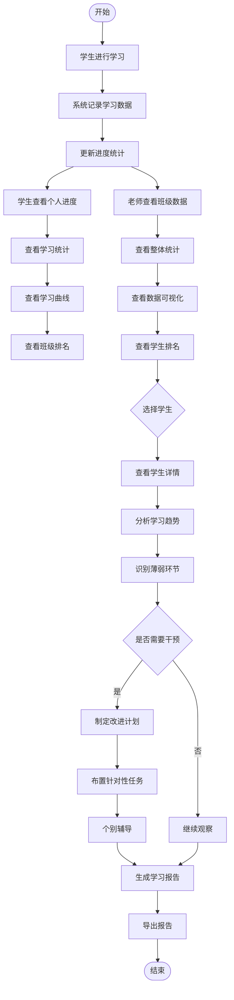

---

## 7. 教师工作量统计与考核

### 涉及角色
- **老师**：日常教学活动
- **管理员**：统计和考核教师工作

### 业务场景描述
系统自动统计教师的工作数据，管理员可以查看教师工作报表并进行考核评价。

### 详细交互流程

#### 阶段1：教师工作数据采集
系统自动记录教师的工作活动：

**任务管理数据**
- 创建任务数量
- 任务类型分布
- 任务完成率
- 任务反馈数量

**学生管理数据**
- 管理学生数量
- 学生进度查看次数
- 个别辅导记录
- 家长沟通记录

**班级管理数据**
- 管理班级数量
- 班级公告发布数量
- 班级活动组织次数

**错题管理数据**
- 错题分析次数
- 复习任务创建数量
- 错题反馈数量

**数据流转：**
```
教学模块 → API: POST /api/teacher-activities
{
  teacherId: "T001",
  activityType: "create_task",
  data: {
    taskId: "TASK001",
    targetType: "class",
    targetCount: 35
  },
  timestamp: "2026-02-19T10:00:00Z"
}
```

#### 阶段2：教师查看个人工作统计
1. 老师进入个人中心
2. 查看工作统计：
   - 本周工作时长
   - 任务创建数量
   - 学生辅导次数
   - 反馈数量
3. 查看工作趋势图
4. 对比历史数据

#### 阶段3：管理员查看教师工作报表
1. 管理员进入"教师管理"页面
2. 查看教师列表和基本统计
3. 选择时间范围（周/月/学期）
4. 查看教师工作数据：
   - 工作量排名
   - 任务创建统计
   - 学生管理情况
   - 教学效果数据

**数据流转：**
```
管理员端 → API: GET /api/teachers/statistics
参数: {
  startDate: "2026-02-01",
  endDate: "2026-02-28"
}
响应: {
  teachers: [
    {
      teacherId: "T001",
      teacherName: "李老师",
      statistics: {
        tasksCreated: 15,
        studentsManaged: 35,
        feedbackCount: 120,
        avgResponseTime: 3600,
        classAvgAccuracy: 85
      }
    }
  ]
}
```

#### 阶段4：查看教师详细数据
1. 点击教师姓名进入详情页
2. 查看工作明细：
   - 每日工作记录
   - 任务创建列表
   - 学生辅导记录
   - 反馈内容质量
3. 查看教学效果：
   - 班级整体进步
   - 学生满意度
   - 任务完成率
4. 查看工作质量评估：
   - 反馈及时性
   - 任务设计合理性
   - 学生进步幅度


#### 阶段5：教师考核评价
1. 管理员根据数据进行考核
2. 设置考核指标：
   - 工作量指标（任务数、反馈数）
   - 质量指标（任务完成率、学生进步）
   - 效率指标（响应时间、处理速度）
   - 满意度指标（学生评价）
3. 计算综合得分
4. 填写考核评语
5. 保存考核结果

**数据流转：**
```
管理员端 → API: POST /api/teachers/:id/evaluation
{
  teacherId: "T001",
  period: "2026-02",
  scores: {
    workload: 90,
    quality: 85,
    efficiency: 88,
    satisfaction: 92
  },
  totalScore: 88.75,
  comment: "工作认真负责，教学效果显著",
  evaluatorId: "ADMIN001"
}
```

#### 阶段6：教师查看考核结果
1. 老师收到考核通知
2. 查看考核详情：
   - 各项得分
   - 综合评价
   - 改进建议
3. 对比历史考核
4. 制定改进计划

#### 阶段7：生成工作报告
1. 管理员可以生成报告：
   - 教师个人工作报告
   - 教师团队工作报告
   - 学期工作总结
2. 报告内容：
   - 工作数据统计
   - 教学效果分析
   - 优秀案例展示
   - 改进建议
3. 导出和分享报告

### 关键数据实体
```javascript
// 教师工作统计
{
  id: "TS001",
  teacherId: "T001",
  period: "2026-02",
  statistics: {
    tasksCreated: 15,
    tasksTypes: {
      word_learning: 8,
      reading: 4,
      listening: 3
    },
    studentsManaged: 35,
    feedbackCount: 120,
    avgResponseTime: 3600,
    classesManaged: 1,
    announcementsPublished: 8,
    errorReviewsCreated: 12
  },
  performance: {
    avgTaskCompletionRate: 92,
    avgClassAccuracy: 85,
    studentProgressRate: 15,
    studentSatisfaction: 4.5
  }
}

// 教师考核
{
  id: "TE001",
  teacherId: "T001",
  period: "2026-02",
  scores: {
    workload: 90,
    quality: 85,
    efficiency: 88,
    satisfaction: 92
  },
  totalScore: 88.75,
  rank: 3,
  comment: "工作认真负责，教学效果显著",
  evaluatorId: "ADMIN001",
  evaluatedAt: "2026-03-01T10:00:00Z"
}
```

### 考核指标体系
```javascript
// 考核指标
{
  工作量指标: {
    任务创建数量: { weight: 0.2, target: 10 },
    反馈数量: { weight: 0.15, target: 80 },
    学生管理数量: { weight: 0.1, target: 30 }
  },
  质量指标: {
    任务完成率: { weight: 0.2, target: 90 },
    班级平均正确率: { weight: 0.15, target: 80 },
    学生进步率: { weight: 0.1, target: 10 }
  },
  效率指标: {
    平均响应时间: { weight: 0.05, target: 7200 },
    任务设计合理性: { weight: 0.05, target: 4 }
  }
}
```

### 异常处理
- 工作量异常低 → 系统预警提醒
- 教学效果持续下降 → 管理员关注
- 学生投诉较多 → 触发调查机制

### 活动图（PlantUML）

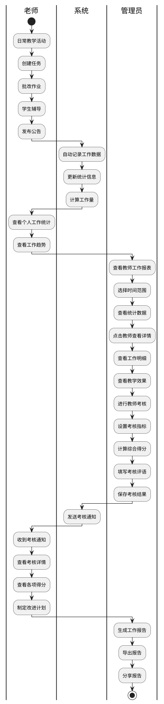

---

## 8. 单词收藏与个性化学习

### 涉及角色
- **学生**：收藏单词、个性化学习

### 业务场景描述
学生在学习过程中可以收藏难记的单词，系统根据遗忘曲线智能推送复习提醒，实现个性化学习。


### 详细交互流程

#### 阶段1：学生收藏单词
1. 学生在学习单词时
2. 遇到难记的单词
3. 点击"收藏"按钮
4. 可以添加个人笔记：
   - 记忆技巧
   - 易混淆点
   - 个人理解
5. 单词添加到收藏夹

**数据流转：**
```
学生端 → API: POST /api/favorites
{
  studentId: "S001",
  wordId: "W001",
  word: "abandon",
  note: "ab-离开 + and-和 + on，记忆：离开和在上面的东西",
  difficulty: "hard",
  source: "任务学习"
}
```

#### 阶段2：查看收藏夹
1. 学生进入"单词收藏"页面（`/student/word-favorites`）
2. 查看收藏的单词列表
3. 可以按以下方式筛选：
   - 按难度（简单/中等/困难）
   - 按收藏时间
   - 按掌握程度
   - 按复习次数
4. 搜索特定单词
5. 查看单词详情：
   - 单词信息
   - 个人笔记
   - 收藏时间
   - 复习记录

#### 阶段3：复习收藏单词
1. 点击"开始复习"
2. 系统根据算法推荐复习单词：
   - 优先复习长时间未复习的
   - 优先复习掌握程度低的
   - 根据遗忘曲线安排复习
3. 进入复习模式：
   - 看英文回忆中文
   - 看中文拼写英文
   - 例句填空
4. 完成复习练习
5. 系统更新掌握程度

**数据流转：**
```
学生端 → API: POST /api/favorites/:id/review
{
  favoriteId: "F001",
  studentId: "S001",
  reviewResult: {
    correct: true,
    timeSpent: 30,
    reviewType: "spelling"
  }
}

系统响应: {
  masteryLevel: "medium", // 更新后的掌握程度
  nextReviewAt: "2026-02-21T14:00:00Z" // 下次复习时间
}
```

#### 阶段4：智能复习提醒
系统根据遗忘曲线自动计算复习时间：

**遗忘曲线算法**
```javascript
// 复习间隔（天）
const reviewIntervals = {
  first: 1,    // 第1次复习：1天后
  second: 3,   // 第2次复习：3天后
  third: 7,    // 第3次复习：7天后
  fourth: 15,  // 第4次复习：15天后
  fifth: 30    // 第5次复习：30天后
}

// 根据掌握程度调整
if (masteryLevel === 'weak') {
  interval *= 0.5  // 缩短间隔
} else if (masteryLevel === 'strong') {
  interval *= 1.5  // 延长间隔
}
```

**推送复习提醒**
1. 系统每天检查需要复习的单词
2. 发送复习提醒通知
3. 学生登录时显示待复习数量
4. 点击进入复习模式

#### 阶段5：取消收藏
1. 学生认为已经掌握的单词
2. 可以从收藏夹移除
3. 系统保留历史记录
4. 可以重新收藏

#### 阶段6：收藏数据分析
学生可以查看收藏统计：
- 收藏单词总数
- 已掌握单词数
- 待复习单词数
- 复习完成率
- 掌握程度分布

### 关键数据实体
```javascript
// 单词收藏
{
  id: "F001",
  studentId: "S001",
  wordId: "W001",
  word: "abandon",
  note: "个人记忆笔记",
  difficulty: "hard",
  masteryLevel: "weak" | "medium" | "strong",
  reviewCount: 3,
  lastReviewAt: "2026-02-19T14:00:00Z",
  nextReviewAt: "2026-02-21T14:00:00Z",
  createdAt: "2026-02-15T10:00:00Z",
  source: "任务学习"
}

// 复习记录
{
  id: "R001",
  favoriteId: "F001",
  studentId: "S001",
  reviewType: "spelling" | "meaning" | "usage",
  result: "correct" | "wrong",
  timeSpent: 30,
  reviewedAt: "2026-02-19T14:00:00Z"
}
```

### 个性化学习特性

**智能推荐**
- 根据错题自动推荐相关单词
- 根据学习进度推荐新单词
- 根据兴趣推荐主题单词

**学习计划**
- 每日学习目标设置
- 自动生成学习计划
- 进度跟踪和提醒

**学习模式**
- 快速复习模式（只看不练）
- 深度学习模式（多种练习）
- 游戏化学习模式（趣味练习）

### 异常处理
- 收藏数量过多（>500）→ 建议清理已掌握单词
- 长期未复习 → 系统持续提醒
- 复习效果差 → 推荐调整学习方法


### 活动图（Mermaid）

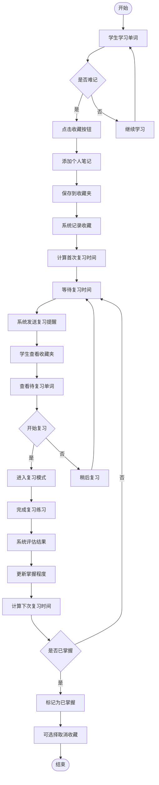

---

## 活动图绘制指南

### 一、活动图基本概念

活动图（Activity Diagram）是UML中用于描述业务流程、工作流程或算法逻辑的图表。它展示了从开始到结束的活动序列和决策点。

### 二、活动图基本元素

#### 1. 基础元素
```
● 开始节点（Initial Node）：实心圆，表示流程开始
◉ 结束节点（Final Node）：圆圈包实心圆，表示流程结束
⬭ 活动（Activity）：圆角矩形，表示一个操作或任务
◆ 判断（Decision）：菱形，表示条件分支
→ 控制流（Control Flow）：箭头，表示流程方向
```

#### 2. 高级元素
```
║ 泳道（Swimlane）：垂直分栏，区分不同角色或系统
▬ 分支/合并（Fork/Join）：粗横杠，表示并行流程
📝 注释（Note）：附加说明信息
```

### 三、绘图工具推荐

#### 1. PlantUML（推荐用于代码生成）
**优点：**
- 使用代码生成图表，易于版本控制
- 支持多种图表类型
- 可集成到文档系统

**安装：**
```bash
# 需要Java环境
# 安装Graphviz
# 使用VS Code插件：PlantUML
```

**基本语法：**
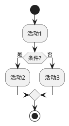

#### 2. Mermaid（推荐用于Markdown集成）
**优点：**
- 语法简单
- 可直接在Markdown中使用
- GitHub、GitLab原生支持

**基本语法：**
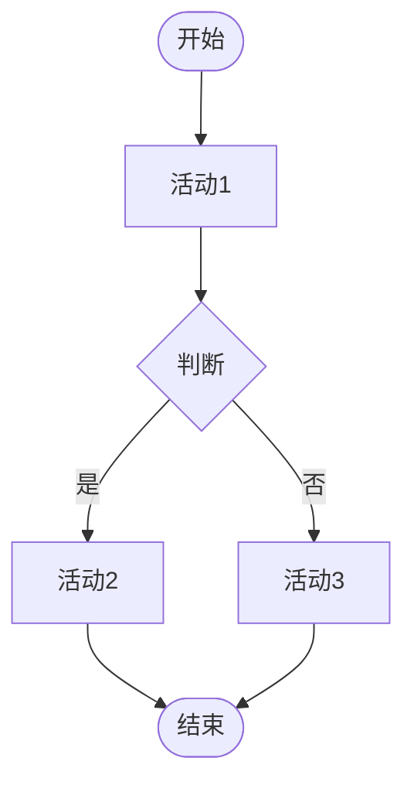

#### 3. Draw.io / Diagrams.net（推荐用于可视化编辑）
**优点：**
- 完全免费
- 在线/离线都可用
- 拖拽式操作，直观易用
- 支持导出多种格式

**访问：** https://app.diagrams.net/

#### 4. Microsoft Visio（专业工具）
**优点：**
- 功能强大
- 模板丰富
- 企业级应用

**缺点：**
- 需要付费
- 仅支持Windows

### 四、绘制步骤详解

#### 步骤1：确定参与角色
列出所有参与流程的角色或系统：
- 学生
- 老师
- 管理员
- 系统

#### 步骤2：梳理主流程
从开始到结束的主要路径：
1. 谁发起？
2. 做什么？
3. 传递给谁？
4. 谁响应？
5. 如何结束？

#### 步骤3：识别决策点
找出需要判断的地方：
- 是否批准？
- 是否成功？
- 选择哪个分支？

#### 步骤4：添加异常流程
考虑异常情况：
- 失败怎么办？
- 超时怎么处理？
- 取消如何退出？

#### 步骤5：标注数据流转
在关键节点标注：
- 传递什么数据？
- 数据格式是什么？
- 存储在哪里？


### 五、PlantUML完整示例

#### 示例1：带泳道的复杂流程

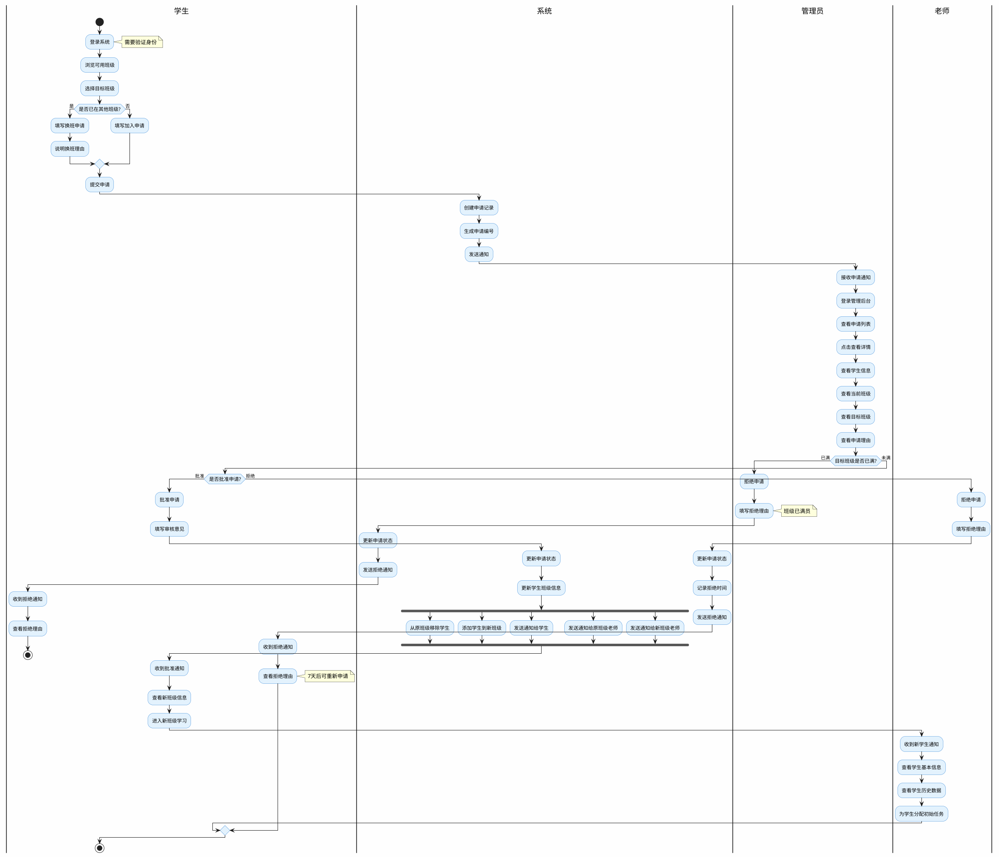

#### 示例2：并行流程

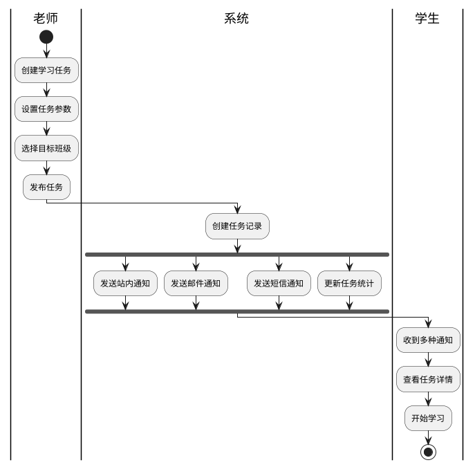

### 六、Mermaid完整示例

#### 示例1：状态转换流程

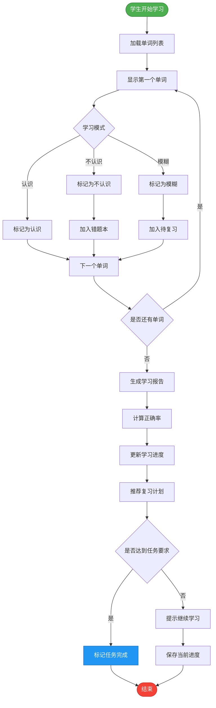

#### 示例2：时序流程

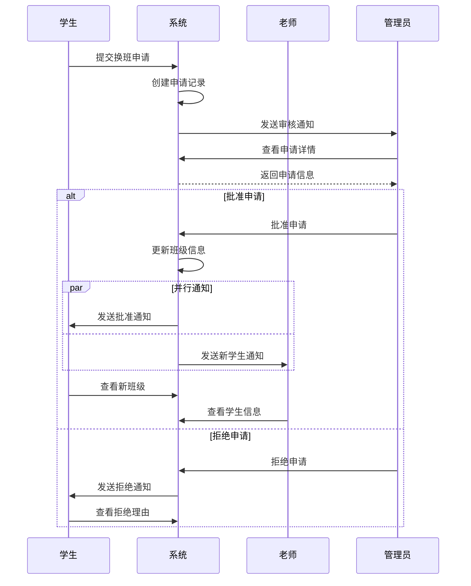

### 七、绘图最佳实践

#### 1. 布局原则
- 从上到下或从左到右
- 保持流程清晰，避免交叉
- 相关活动靠近放置
- 使用泳道区分角色

#### 2. 命名规范
- 活动使用动词开头："创建任务"、"查看数据"
- 判断使用疑问句："是否批准？"、"是否成功？"
- 简洁明了，避免冗长描述

#### 3. 颜色使用
```plantuml
skinparam activity {
  BackgroundColor #E3F2FD  // 浅蓝色背景
  BorderColor #1976D2       // 深蓝色边框
  StartColor #4CAF50        // 绿色开始
  EndColor #F44336          // 红色结束
}
```

#### 4. 复杂度控制
- 单个图表不超过20个活动
- 超过则拆分为多个子流程
- 使用子流程引用

#### 5. 文档化
- 添加必要的注释
- 说明关键决策依据
- 标注异常处理方式

### 八、常见问题与解决

#### 问题1：流程太复杂，图表混乱
**解决方案：**
- 拆分为多个子流程图
- 使用子流程引用
- 简化非关键路径

#### 问题2：角色太多，泳道拥挤
**解决方案：**
- 合并相似角色
- 将系统操作单独列出
- 使用多页图表

#### 问题3：异常流程难以表达
**解决方案：**
- 使用不同颜色标注
- 添加注释说明
- 单独绘制异常流程图

#### 问题4：工具选择困难
**建议：**
- 快速原型：Mermaid
- 正式文档：PlantUML
- 演示汇报：Draw.io
- 企业应用：Visio

### 九、实战练习建议

1. 从简单流程开始（如用户登录）
2. 逐步增加复杂度（添加角色、判断）
3. 练习不同工具的使用
4. 对比不同表达方式的优劣
5. 收集反馈，持续改进

---

## 附录：快速参考

### PlantUML语法速查

```plantuml
@startuml
' 基本元素
start
:活动;
if (判断?) then (是)
  :活动A;
else (否)
  :活动B;
endif
stop

' 泳道
|角色1|
:活动1;
|角色2|
:活动2;

' 并行
fork
  :并行活动1;
fork again
  :并行活动2;
end fork

' 循环
repeat
  :重复活动;
repeat while (继续?) is (是)

' 注释
note right
  这是注释
end note
@enduml
```

### Mermaid语法速查

```mermaid
graph TD
    A[活动] --> B{判断}
    B -->|是| C[活动A]
    B -->|否| D[活动B]
    C --> E([结束])
    D --> E
    
    ' 样式
    style A fill:#f9f,stroke:#333
```

### 常用图标

```
● 开始    ◉ 结束    ⬭ 活动
◆ 判断    → 流程    ║ 泳道
▬ 并行    📝 注释    ⚠ 警告
```

---

## 总结

本文档详细说明了英语学习系统的8个主要业务场景，包括：

1. 班级申请与审批流程（学生-管理员-老师）
2. 学习任务发布与完成反馈（老师-学生）
3. 错题管理与复习指导（学生-老师）
4. 用户账号管理（管理员-用户）
5. 班级创建与分配（管理员-老师-学生）
6. 学习进度跟踪与评估（学生-老师）
7. 教师工作量统计与考核（老师-管理员）
8. 单词收藏与个性化学习（学生）

每个场景都包含了详细的交互流程、数据流转、关键实体和活动图示例。同时提供了完整的活动图绘制指南，帮助理解和绘制业务流程图。

**文档版本：** v1.0  
**创建日期：** 2026-02-19  
**最后更新：** 2026-02-19
```

---

## 使用建议

1. 根据实际需求选择合适的业务场景进行开发
2. 使用提供的活动图代码生成可视化流程图
3. 根据数据实体设计数据库表结构
4. 参考API数据流转设计接口
5. 使用绘图工具创建更详细的流程文档
