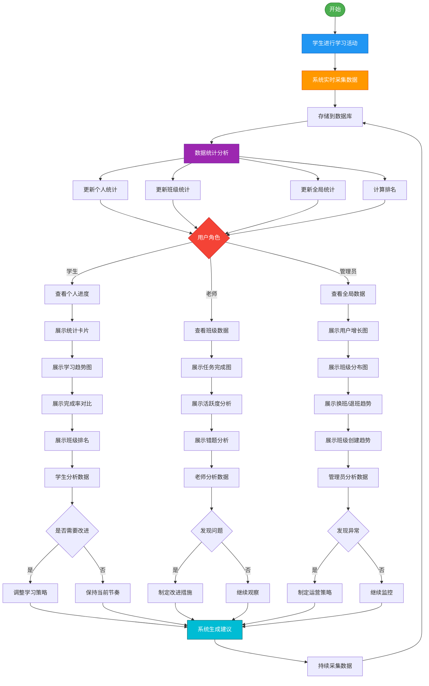

# 学习数据采集、分析与可视化展示业务场景

## 场景概述

本场景描述了英语学习系统中学习数据的完整生命周期：从学生的学习行为产生数据，到系统实时采集和统计分析，再到为不同角色（学生、老师）提供个性化的数据可视化展示，最终驱动教学决策和学习改进的全过程。

---

## 涉及角色

- **学生**：产生学习数据、查看个人进度和班级排名
- **老师**：查看班级数据分析、识别问题学生、调整教学策略
- **管理员**：查看全局数据统计、监控系统运营、管理用户和班级
- **系统**：实时采集数据、统计分析、生成可视化图表、计算排名

---

## 业务价值

### 对学生
- 清晰了解自己的学习进度和效果
- 通过班级排名激励学习动力
- 对比班级平均水平发现差距
- 根据数据调整学习策略

### 对老师
- 全面掌握班级整体学习情况
- 快速识别需要帮助的学生
- 数据驱动的教学决策
- 评估教学效果和任务设计合理性

### 对管理员
- 全局掌握系统运营状况
- 监控用户增长和活跃度
- 评估各班级和教师表现
- 数据驱动的资源分配决策

### 对系统
- 沉淀学习行为数据
- 构建学习画像
- 支持智能推荐和预警

---

## 完整业务流程

### 阶段1：学习数据实时采集（学生 → 系统）

#### 1.1 学生学习行为
学生在系统中进行各种学习活动：
- 单词学习（查看、记忆、测试）
- 完成学习任务
- 做练习题
- 复习错题
- 收藏单词

#### 1.2 系统实时记录
系统在学生学习过程中自动采集数据：


**采集的数据类型**：
```javascript
// 学习行为数据
{
  studentId: "S001",
  timestamp: "2026-02-20T14:30:00Z",
  activityType: "word_learning" | "task_completion" | "exercise" | "error_review",
  
  // 单词学习数据
  wordLearning: {
    wordIds: ["W001", "W002", "W003"],
    studyTime: 600,  // 秒
    correctCount: 28,
    wrongCount: 2,
    accuracy: 93.3
  },
  
  // 任务完成数据
  taskCompletion: {
    taskId: "TASK001",
    completionTime: 1800,
    score: 85,
    status: "completed"
  },
  
  // 错题数据
  errors: [
    {
      wordId: "W005",
      errorType: "spelling",
      attemptCount: 3
    }
  ]
}
```

#### 1.3 数据存储与更新
系统将采集的数据存储到数据库，并实时更新统计信息：
- 累计学习时长
- 累计查词量
- 任务完成数
- 错题总数
- 正确率统计
- 每日学习记录

**数据流转**：
```
学习模块 → API: POST /api/learning/record
→ 数据库存储
→ 实时统计更新
→ 触发排名重新计算
```

---

### 阶段2：数据统计与分析（系统后台处理）

#### 2.1 个人数据统计
系统为每个学生计算个人统计数据：

**每日统计**：
```javascript
{
  studentId: "S001",
  date: "2026-02-20",
  dailyStats: {
    studyTime: 3600,        // 今日学习时长（秒）
    wordsLearned: 50,       // 今日学习单词数
    tasksCompleted: 2,      // 今日完成任务数
    accuracy: 85,           // 今日正确率
    loginCount: 3           // 今日登录次数
  }
}
```

**周统计**：
```javascript
{
  studentId: "S001",
  weekRange: "2026-02-17 ~ 2026-02-23",
  weeklyStats: {
    totalTime: 18.5,        // 本周总学习时长（小时）
    avgDailyTime: 2.6,      // 日均学习时长
    totalWords: 337,        // 本周学习单词数
    tasksCompleted: 8,      // 本周完成任务数
    avgAccuracy: 87,        // 本周平均正确率
    activeDays: 7           // 本周活跃天数
  }
}
```

**累计统计**：
```javascript
{
  studentId: "S001",
  cumulativeStats: {
    totalWords: 1250,       // 累计查词量
    totalTime: 156.5,       // 累计学习时长（小时）
    totalTasks: 45,         // 累计完成任务数
    totalErrors: 89,        // 累计错题数
    avgAccuracy: 85.5       // 总体平均正确率
  }
}
```

#### 2.2 班级数据统计
系统汇总班级整体数据：

**任务完成统计**：
```javascript
{
  classId: "C001",
  taskStats: [
    {
      taskId: "TASK001",
      taskName: "第三单元单词学习",
      totalStudents: 40,
      completedCount: 35,
      uncompletedCount: 5,
      completionRate: 87.5,
      avgScore: 82.3
    }
    // ... 更多任务
  ]
}
```

**学习活跃度统计**：
```javascript
{
  classId: "C001",
  activityStats: {
    dates: ["周一", "周二", "周三", "周四", "周五", "周六", "周日"],
    tasksCompleted: [220, 182, 191, 234, 290, 330, 310],
    exercisesCount: [150, 232, 201, 154, 190, 330, 410],
    activeStudents: [38, 35, 37, 40, 39, 36, 34]
  }
}
```

**错题类型分析**：
```javascript
{
  classId: "C001",
  errorAnalysis: {
    types: [
      { name: "选择题", count: 335, percentage: 46.7 },
      { name: "填空题", count: 234, percentage: 32.6 },
      { name: "单词拼写", count: 148, percentage: 20.7 }
    ],
    topErrorWords: [
      { word: "abandon", errorCount: 15 },
      { word: "ability", errorCount: 12 }
    ]
  }
}
```

#### 2.3 排名计算
系统计算班级内学生排名：

**按学习时长排名**：
```javascript
{
  classId: "C001",
  rankType: "studyTime",
  rankings: [
    { rank: 1, studentId: "S005", studentName: "李明", studyTime: 22.5, masteredWords: 385 },
    { rank: 2, studentId: "S012", studentName: "王芳", studyTime: 21.2, masteredWords: 368 },
    { rank: 3, studentId: "S008", studentName: "张伟", studyTime: 20.8, masteredWords: 352 },
    // ... 更多排名
  ]
}
```

**按掌握单词量排名**：
```javascript
{
  classId: "C001",
  rankType: "masteredWords",
  rankings: [
    { rank: 1, studentId: "S005", studentName: "李明", studyTime: 22.5, masteredWords: 385 },
    { rank: 2, studentId: "S012", studentName: "王芳", studyTime: 21.2, masteredWords: 368 },
    // ... 更多排名
  ]
}
```

#### 2.4 对比数据计算
系统计算个人与班级平均的对比数据：

```javascript
{
  studentId: "S001",
  classId: "C001",
  comparison: {
    dates: ["周一", "周二", "周三", "周四", "周五", "周六", "周日"],
    personalCompletion: [70, 75, 82, 85, 88, 90, 92],  // 个人完成率
    classAvgCompletion: [75, 78, 80, 82, 85, 87, 88],  // 班级平均完成率
    personalRank: 6,
    totalStudents: 40,
    aboveAverage: true
  }
}
```

---

### 阶段3：学生查看个人进度（学生 ↔ 系统）

#### 3.1 学生进入进度页面
1. 学生登录系统
2. 点击"我的进度"菜单
3. 进入进度页面（`/student/my-progress`）

#### 3.2 系统加载个人数据
系统根据学生ID加载相关数据：

**API请求**：
```
GET /api/students/:studentId/progress
```

**响应数据**：
```javascript
{
  statistics: {
    totalWords: 1250,
    weekTotalTime: 18.5,
    weekAvgTime: 2.6
  },
  dailyData: {
    dates: ["周一", "周二", "周三", "周四", "周五", "周六", "周日"],
    studyTime: [2.5, 3.2, 2.8, 3.5, 2.0, 2.8, 1.7],
    masteredWords: [45, 58, 52, 62, 38, 50, 32]
  },
  comparison: {
    dates: ["周一", "周二", "周三", "周四", "周五", "周六", "周日"],
    personal: [70, 75, 82, 85, 88, 90, 92],
    classAvg: [75, 78, 80, 82, 85, 87, 88]
  },
  ranking: {
    byTime: { rank: 6, total: 40 },
    byWords: { rank: 5, total: 40 }
  }
}
```


#### 3.3 页面展示数据可视化

**顶部统计卡片**：
- 累计查词量：1250个
- 任务完成数：18.5小时
- 总错题数：2.6小时

**每日学习数据折线图**：
- X轴：周一到周日
- Y轴（左）：学习时长（小时）
- Y轴（右）：掌握单词数（个）
- 双折线图展示每日学习趋势

**班级vs个人完成率走势图**：
- X轴：周一到周日
- Y轴：完成率（%）
- 两条折线对比个人与班级平均

**班级排名表格**：
- 可切换排名类型（学习时长/掌握单词量）
- 显示排名、姓名、数据进度条
- 高亮显示当前学生

#### 3.4 学生分析数据
学生通过可视化数据：
- 了解自己的学习趋势
- 发现学习薄弱时段
- 对比班级平均水平
- 查看自己的排名位置

#### 3.5 学生调整学习策略
根据数据分析结果：
- 增加学习时长（如果低于平均）
- 提高学习效率（如果正确率低）
- 保持学习节奏（如果表现良好）
- 设定新的学习目标

---

### 阶段4：老师查看班级数据（老师 ↔ 系统）

#### 4.1 老师进入班级数据页面
1. 老师登录系统
2. 点击"班级数据"菜单
3. 进入数据分析页面（`/teacher/class-data`）

#### 4.2 老师选择班级
1. 在下拉框中选择要查看的班级
2. 系统加载该班级的数据

**API请求**：
```
GET /api/classes/:classId/statistics
```

**响应数据**：
```javascript
{
  classInfo: {
    id: "C001",
    name: "高级英语班",
    level: "A",
    studentCount: 40
  },
  taskCompletion: {
    tasks: ["任务1", "任务2", "任务3", "任务4", "任务5", "任务6", "任务7", "任务8"],
    completed: [35, 38, 32, 40, 36, 39, 37, 34],
    uncompleted: [5, 2, 8, 0, 4, 1, 3, 6]
  },
  activityTrend: {
    dates: ["周一", "周二", "周三", "周四", "周五", "周六", "周日"],
    tasksCompleted: [220, 182, 191, 234, 290, 330, 310],
    exercisesCount: [150, 232, 201, 154, 190, 330, 410]
  },
  errorAnalysis: {
    types: [
      { name: "选择题", value: 335 },
      { name: "填空题", value: 234 },
      { name: "单词拼写", value: 148 }
    ]
  }
}
```

#### 4.3 系统生成可视化图表

**班级任务完成对比图（柱状图）**：
- X轴：任务1-8
- Y轴：学生人数
- 堆叠柱状图：已完成（绿色）+ 未完成（红色）
- 直观展示每个任务的完成情况

**学生学习活跃分析图（折线图）**：
- X轴：周一到周日
- Y轴：数量
- 两条折线：完成任务数、练习题数
- 展示班级整体学习活跃度趋势

**学生错题类型分析图（饼图）**：
- 环形饼图展示错题类型分布
- 显示具体数量和百分比
- 不同颜色区分不同类型

#### 4.4 老师分析班级数据

**任务完成情况分析**：
- 识别完成率低的任务 → 可能任务难度过高
- 识别未完成学生 → 需要个别关注
- 对比不同任务的完成率 → 评估任务设计

**学习活跃度分析**：
- 识别活跃度低的时段 → 可能需要调整任务发布时间
- 对比任务数和练习数 → 评估学生自主学习情况
- 发现活跃度趋势 → 预测学习状态

**错题类型分析**：
- 识别高频错题类型 → 针对性讲解
- 分析错题分布 → 调整教学重点
- 对比不同类型占比 → 评估学生薄弱环节

#### 4.5 老师制定改进措施

根据数据分析结果，老师可以：

**针对任务完成率低的情况**：
1. 降低任务难度
2. 延长任务截止时间
3. 提供额外辅导材料
4. 个别辅导未完成学生

**针对学习活跃度低的情况**：
1. 调整任务发布时间
2. 增加趣味性学习内容
3. 设置学习激励机制
4. 与学生沟通了解原因

**针对错题类型集中的情况**：
1. 专项讲解高频错题类型
2. 布置针对性练习任务
3. 创建错题复习任务
4. 调整教学方法

#### 4.6 老师切换班级对比
老师可以切换不同班级查看数据：
- 对比不同班级的表现
- 识别教学效果差异
- 分享优秀班级的经验
- 调整不同班级的教学策略

---

### 阶段5：管理员查看全局数据（管理员 ↔ 系统）

#### 5.1 管理员进入数据中心
1. 管理员登录系统
2. 进入管理员首页（`/admin/home`）
3. 查看全局数据概览

#### 5.2 系统加载全局统计数据
系统汇总整个平台的数据：

**API请求**：
```
GET /api/admin/statistics
```

**响应数据**：
```javascript
{
  // 总体统计
  overview: {
    totalStudents: 156,
    totalTeachers: 12,
    totalClasses: 8,
    activeUsers: 45  // 今日活跃用户
  },
  
  // 待处理事项
  pendingTasks: {
    pendingClasses: 3,    // 待审核班级
    newUsers: 8,          // 新注册用户
    activeUsers: 45       // 今日活跃用户
  },
  
  // 用户增长趋势
  userGrowth: {
    months: ['1月', '2月', '3月', '4月', '5月', '6月', '7月'],
    students: [20, 35, 48, 65, 88, 120, 156],
    teachers: [2, 3, 5, 6, 8, 10, 12]
  },
  
  // 班级等级分布
  classDistribution: [
    { level: 'A', count: 2, percentage: 25 },
    { level: 'B', count: 2, percentage: 25 },
    { level: 'C', count: 2, percentage: 25 },
    { level: 'D', count: 2, percentage: 25 }
  ],
  
  // 换班趋势
  transferTrend: {
    months: ['1月', '2月', '3月', '4月', '5月', '6月', '7月'],
    counts: [5, 8, 12, 6, 10, 15, 9]
  },
  
  // 退班趋势
  quitTrend: {
    months: ['1月', '2月', '3月', '4月', '5月', '6月', '7月'],
    counts: [3, 5, 2, 8, 4, 6, 3]
  },
  
  // 班级创建趋势
  classCreateTrend: {
    months: ['1月', '2月', '3月', '4月', '5月', '6月', '7月'],
    counts: [2, 3, 1, 4, 2, 3, 2]
  }
}
```

#### 5.3 页面展示全局数据可视化

**顶部统计卡片**：
- 总学生人数：156人（蓝色）
- 总班级数：8个（绿色）
- 总教师数：12人（橙色）

**待处理事项卡片**：
- 待审核班级：3个（可点击跳转）
- 新注册用户：8人（可点击跳转）
- 今日活跃用户：45人

**用户增长趋势图（面积折线图）**：
- X轴：1月到7月
- Y轴：人数
- 两条折线：学生增长（蓝色）、教师增长（绿色）
- 展示平台用户规模增长趋势

**各等级班级分布图（环形饼图）**：
- A级班级：2个（红色）
- B级班级：2个（橙色）
- C级班级：2个（蓝色）
- D级班级：2个（绿色）
- 展示班级等级分布是否均衡

**换班变化趋势图（柱状图）**：
- X轴：1月到7月
- Y轴：换班人数
- 渐变蓝色柱状图
- 展示学生换班活跃度

**退班变化趋势图（面积折线图）**：
- X轴：1月到7月
- Y轴：退班人数
- 红色折线图
- 监控学生流失情况

**班级创建趋势图（柱状图）**：
- X轴：1月到7月
- Y轴：创建班级数
- 渐变绿色柱状图
- 展示班级扩张速度

#### 5.4 管理员分析全局数据

**用户增长分析**：
- 学生增长是否健康 → 评估招生效果
- 教师增长是否匹配 → 评估师资配置
- 增长趋势是否稳定 → 预测未来需求

**班级分布分析**：
- 各等级班级是否均衡 → 调整班级设置
- 是否需要新增班级 → 资源分配决策
- 班级容量是否合理 → 优化班级规模

**换班/退班分析**：
- 换班频率是否正常 → 评估班级匹配度
- 退班原因是否集中 → 识别系统问题
- 流失率是否可控 → 制定挽留策略

**活跃度分析**：
- 今日活跃用户占比 → 评估系统粘性
- 活跃度趋势变化 → 预警用户流失
- 不同角色活跃度 → 优化功能设计

#### 5.5 管理员制定运营策略

根据全局数据分析，管理员可以：

**针对用户增长**：
1. 制定招生计划
2. 优化教师招聘
3. 调整营销策略
4. 设置增长目标

**针对班级管理**：
1. 新增热门等级班级
2. 合并低活跃班级
3. 调整班级容量
4. 优化班级分配规则

**针对用户流失**：
1. 分析退班原因
2. 改进产品体验
3. 加强用户服务
4. 设置挽留机制

**针对系统运营**：
1. 优化资源分配
2. 调整功能优先级
3. 制定运营活动
4. 设置KPI指标

#### 5.6 管理员深入分析
管理员可以点击待处理事项卡片：
- 跳转到班级管理页面处理待审核班级
- 跳转到用户管理页面审核新用户
- 查看活跃用户详细列表

---

### 阶段6：数据反馈与闭环（系统 → 学生/老师/管理员）

#### 5.1 系统生成智能建议

**给学生的建议**：
```javascript
{
  studentId: "S001",
  suggestions: [
    {
      type: "study_time",
      message: "你的学习时长低于班级平均水平，建议每天增加30分钟学习时间",
      priority: "high"
    },
    {
      type: "accuracy",
      message: "你的正确率持续提升，继续保持！",
      priority: "low"
    },
    {
      type: "ranking",
      message: "再努力一点，你就能进入班级前5名了！",
      priority: "medium"
    }
  ]
}
```

**给老师的预警**：
```javascript
{
  classId: "C001",
  alerts: [
    {
      type: "low_completion",
      message: "任务3的完成率仅为80%，建议关注",
      affectedStudents: ["S003", "S007", "S015"],
      priority: "high"
    },
    {
      type: "inactive_students",
      message: "3名学生连续3天未登录",
      affectedStudents: ["S022", "S028", "S035"],
      priority: "critical"
    }
  ]
}
```

**给管理员的预警**：
```javascript
{
  systemAlerts: [
    {
      type: "user_growth",
      message: "本月新增学生数较上月下降30%，建议加强招生",
      priority: "high"
    },
    {
      type: "class_capacity",
      message: "A级班级已满员，建议新增班级",
      priority: "medium"
    },
    {
      type: "quit_rate",
      message: "本月退班率上升至5%，需要关注",
      priority: "critical"
    },
    {
      type: "teacher_workload",
      message: "教师平均管理学生数达到15人，接近上限",
      priority: "medium"
    }
  ]
}
```

#### 5.2 触发后续行动

**学生端**：
- 收到学习建议通知
- 查看推荐的学习内容
- 调整学习计划

**老师端**：
- 收到预警通知
- 查看问题学生列表
- 采取干预措施（布置任务、个别辅导）

**管理员端**：
- 收到系统运营预警
- 查看详细数据报表
- 制定应对策略（新增班级、调整政策）
- 协调资源分配

#### 5.3 持续数据采集
各角色根据建议调整后：
- 系统继续采集新的数据
- 更新各层级统计
- 评估改进效果
- 形成完整数据闭环

---

## 关键数据实体

### 学习记录
```javascript
{
  id: "LR001",
  studentId: "S001",
  timestamp: "2026-02-20T14:30:00Z",
  activityType: "word_learning",
  duration: 600,
  wordsCount: 30,
  correctCount: 28,
  wrongCount: 2,
  accuracy: 93.3
}
```

### 学生统计
```javascript
{
  id: "SS001",
  studentId: "S001",
  date: "2026-02-20",
  dailyStats: {
    studyTime: 3600,
    wordsLearned: 50,
    tasksCompleted: 2,
    accuracy: 85
  },
  weeklyStats: {
    totalTime: 18.5,
    avgDailyTime: 2.6,
    totalWords: 337
  },
  cumulativeStats: {
    totalWords: 1250,
    totalTime: 156.5,
    totalTasks: 45
  }
}
```

### 班级统计
```javascript
{
  id: "CS001",
  classId: "C001",
  date: "2026-02-20",
  taskCompletion: {
    totalTasks: 8,
    avgCompletionRate: 91.25
  },
  activityStats: {
    activeStudents: 38,
    avgStudyTime: 16.8,
    totalExercises: 1577
  },
  errorStats: {
    totalErrors: 717,
    topErrorType: "选择题"
  }
}
```

### 排名记录
```javascript
{
  id: "RK001",
  classId: "C001",
  studentId: "S001",
  date: "2026-02-20",
  rankByTime: 6,
  rankByWords: 5,
  studyTime: 18.5,
  masteredWords: 337,
  totalStudents: 40
}
```

### 全局统计
```javascript
{
  id: "GS001",
  date: "2026-02-20",
  overview: {
    totalStudents: 156,
    totalTeachers: 12,
    totalClasses: 8,
    activeUsers: 45
  },
  userGrowth: {
    newStudents: 8,
    newTeachers: 1,
    growthRate: 5.4
  },
  classStats: {
    avgStudentsPerClass: 19.5,
    avgStudentsPerTeacher: 13,
    classUtilization: 78.5
  },
  activityStats: {
    dailyActiveRate: 28.8,
    weeklyActiveRate: 65.4,
    avgSessionTime: 45.6
  }
}
```

---

## 技术实现要点

### 数据采集
- 前端埋点：在关键操作处记录数据
- 实时上报：使用防抖/节流优化请求频率
- 离线缓存：网络异常时本地存储，恢复后上传

### 数据统计
- 定时任务：每天凌晨统计前一天数据
- 增量更新：实时更新当天数据
- 缓存机制：热点数据Redis缓存

### 数据可视化
- ECharts图表库
- 响应式设计：适配不同屏幕
- 懒加载：按需加载图表数据

### 排名计算
- 定时计算：每小时更新一次排名
- 分页查询：大班级分页加载排名
- 缓存优化：排名数据缓存30分钟


---

## 业务活动图

### 完整流程活动图（PlantUML）


---

### 简化版活动图（Mermaid）



---

### 数据流转时序图（Mermaid）


---

## 异常处理

### 数据采集异常
- **网络中断**：本地缓存数据，恢复后批量上传
- **数据格式错误**：前端验证 + 后端校验
- **重复提交**：根据时间戳和活动ID去重

### 统计计算异常
- **数据量过大**：分批处理，使用消息队列
- **计算超时**：设置超时时间，异步处理
- **数据不一致**：定期全量校验，修复异常数据

### 图表展示异常
- **数据为空**：显示空状态提示
- **图表渲染失败**：降级显示表格数据
- **加载超时**：显示加载失败，提供重试按钮

---

## 性能优化

### 数据采集优化
- 批量上报：累积多条记录一次性提交
- 防抖节流：避免频繁请求
- 压缩传输：减少数据传输量

### 统计计算优化
- 增量计算：只计算变化的数据
- 预计算：提前计算常用统计
- 并行处理：多个统计任务并行执行

### 查询优化
- 索引优化：为常用查询字段建立索引
- 缓存策略：热点数据Redis缓存
- 分页加载：大数据量分页查询

### 前端优化
- 图表懒加载：滚动到可视区域再渲染
- 数据缓存：避免重复请求
- 虚拟滚动：大列表使用虚拟滚动

---

## 扩展功能

### 数据导出
- 导出个人学习报告（PDF）
- 导出班级数据报表（Excel）
- 导出图表图片

### 数据对比
- 不同时间段对比
- 不同班级对比
- 不同学生对比

### 智能分析
- 学习习惯分析
- 学习效率评估
- 进步趋势预测
- 个性化学习建议

### 数据预警
- 学习时长预警
- 正确率下降预警
- 长期未登录预警
- 任务逾期预警

---

## 总结

本业务场景完整描述了学习数据从产生、采集、统计、分析到可视化展示的全过程，涵盖了学生、老师和管理员三个主要角色的使用场景。通过数据驱动的方式，帮助学生了解自己的学习情况，激励学习动力；帮助老师全面掌握班级状态，做出科学的教学决策；帮助管理员监控系统运营，优化资源配置。系统通过实时数据采集、智能统计分析和直观的可视化展示，形成了一个完整的数据闭环，三方协同持续优化教学效果。

**核心价值**：
- 数据驱动决策（三个层级）
- 个性化学习指导（学生）
- 精准教学干预（老师）
- 科学运营管理（管理员）
- 持续效果评估（系统）

**技术特点**：
- 实时数据采集
- 多维度统计分析
- 分层级数据展示
- ECharts可视化
- 智能建议推送
- 三方协同闭环

**角色协同**：
- 学生产生数据 → 系统分析 → 学生改进学习
- 老师查看数据 → 识别问题 → 干预指导学生
- 管理员监控数据 → 发现异常 → 优化系统运营
- 三方数据互通，形成完整教学生态

---

**文档版本：** v2.0（三方身份版）  
**创建日期：** 2026-02-20  
**最后更新：** 2026-02-20  
**适用页面：**
- `/student/my-progress` - 学生进度页面
- `/teacher/class-data` - 班级数据页面
- `/admin/home` - 管理员数据中心
```
