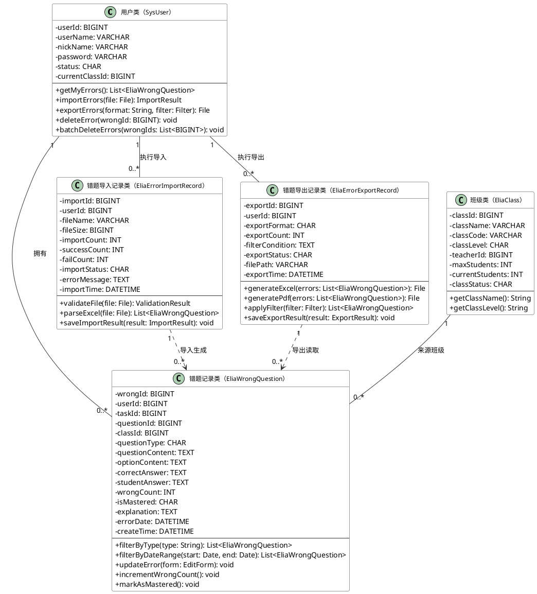
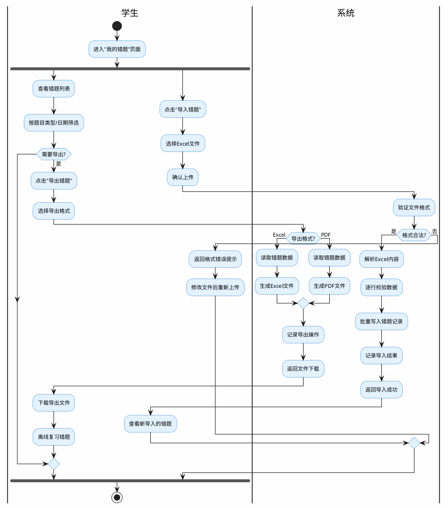
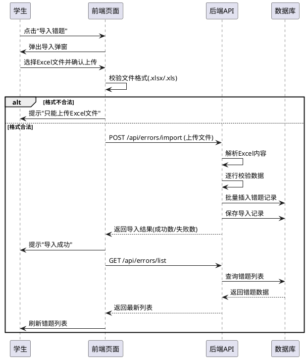
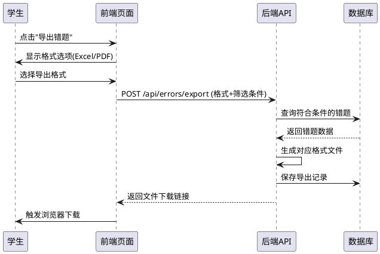

# 学生错题导入导出业务场景类图

## 场景概述

本场景描述了英语学习系统中学生错题导入导出的核心业务。学生在完成学习任务后，系统自动记录答错的题目形成错题记录；学生可以在"我的错题"页面查看、筛选、编辑错题，并支持将错题导出为 Excel 或 PDF 文件以便离线复习，同时支持从 Excel 文件导入外部错题数据到系统中进行统一管理。

---

## 业务场景类图（PlantUML）



---

## 类图静态描述

### 1.1.1 在本业务场景的类图中，涉及到用户类、班级类、错题记录类、错题导入记录类和错题导出记录类。

用户类（SysUser）：用户ID、用户账号、用户昵称、密码、当前班级ID。用户类在本场景中承担学生角色。作为学生时，提供查看个人错题列表、按题目类型和日期范围筛选错题、从Excel文件导入外部错题、将错题导出为Excel或PDF格式文件、删除单条错题和批量删除错题等功能。

班级类（EliaClass）：班级ID、班级名称、班级代码、班级等级（A/B/C/D）、教师ID、最大学生数、当前学生数、班级状态。班级类在本场景中作为错题记录的来源标识，每条错题记录关联一个班级，用于标记该错题产生于哪个班级的学习任务中。班级类提供获取班级名称和获取班级等级等功能，在错题列表展示和导出文件中作为分类维度使用。

错题记录类（EliaWrongQuestion）：错题ID、用户ID、任务ID、题目ID、班级ID、题目类型（选择题/填空题/单词拼写）、题目内容、选项内容、正确答案、学生答案、错误次数(教师端内容)、错误日期、创建时间。错题记录类是本业务场景的核心实体，记录学生在完成学习任务时答错的每一道题目的完整信息，包括题目内容、正确答案与学生的错误答案。错题记录类提供按题目类型筛选错题、按日期范围筛选错题、编辑更新错题信息、累加错误次数和标记为已掌握等功能。错题记录类既是导出操作的数据来源，也是导入操作的数据写入目标。

错题导入记录类（EliaErrorImportRecord）：导入ID、用户ID、文件名称、文件大小、导入总数、成功条数、失败条数、导入状态（处理中/成功/失败）、错误信息、导入时间。错题导入记录类负责管理学生从Excel文件导入错题的全过程，记录每次导入操作的执行情况和结果。错题导入记录类提供验证上传文件格式（仅支持.xlsx和.xls）、解析Excel文件内容转换为错题记录对象列表和保存导入结果等功能。每次导入操作会生成一条导入记录，并根据解析结果批量创建对应的错题记录。

错题导出记录类（EliaErrorExportRecord）：导出ID、用户ID、导出格式（Excel/PDF）、导出条数、筛选条件、导出状态（处理中/成功/失败）、文件路径、导出时间。错题导出记录类负责管理学生将错题数据导出为文件的全过程，支持导出为Excel和PDF两种格式。错题导出记录类提供生成Excel格式文件、生成PDF格式文件、应用筛选条件获取待导出的错题列表和保存导出结果等功能。学生可以选择导出全部错题或仅导出当前筛选条件下的错题。

---

## 类之间的关系说明

### 一对多关系（1:N）
- 用户类（SysUser） → 错题记录类（EliaWrongQuestion）：一个学生拥有多条错题记录，每条错题记录归属于一个学生
- 用户类（SysUser） → 错题导入记录类（EliaErrorImportRecord）：一个学生可以执行多次导入操作，每次导入操作归属于一个学生
- 用户类（SysUser） → 错题导出记录类（EliaErrorExportRecord）：一个学生可以执行多次导出操作，每次导出操作归属于一个学生
- 班级类（EliaClass） → 错题记录类（EliaWrongQuestion）：一个班级下可以产生多条错题记录，每条错题记录关联一个来源班级

### 依赖关系（Dependency）
- 错题导入记录类（EliaErrorImportRecord） ··> 错题记录类（EliaWrongQuestion）：导入操作解析Excel文件后批量生成错题记录，导入记录依赖错题记录类完成数据写入
- 错题导出记录类（EliaErrorExportRecord） ··> 错题记录类（EliaWrongQuestion）：导出操作需要读取错题记录数据生成文件，导出记录依赖错题记录类提供数据来源

---

## 业务活动图（PlantUML）



---

## 导入Excel文件格式要求

| 列序号 | 列名称 | 数据类型 | 说明 |
|--------|--------|----------|------|
| 第一列 | 题目内容 | 文本 | 题目的完整内容 |
| 第二列 | 题目类型 | 文本 | 选择题/填空题/单词拼写 |
| 第三列 | 正确答案 | 文本 | 该题目的标准答案 |
| 第四列 | 学生答案 | 文本 | 学生的错误答案 |
| 第五列 | 解析说明 | 文本 | 题目解析（可选） |

---

## 导入模块关键接口说明

### importErrors

接口名称：importErrors

接口描述：学生导入错题，上传 Excel 文件后系统解析文件内容，逐行校验数据合法性，将合法的错题数据批量写入 elia_wrong_question 表，同时在 elia_error_import_record 表中记录本次导入的执行结果（成功条数、失败条数、错误原因）。

使用说明：POST 请求，Content-Type 为 multipart/form-data，传入 file（Excel 文件，仅支持 .xlsx 和 .xls 格式）。系统首先校验文件格式和大小，然后通过 EasyExcel 逐行读取 Excel 内容，对每行数据校验 questionContent（题目内容，必填）、questionType（题目类型，必须为选择题/填空题/单词拼写之一）、correctAnswer（正确答案，必填）、studentAnswer（学生答案，必填）、explanation（解析说明，可选）。校验通过的行批量插入 elia_wrong_question 表，校验失败的行记录行号和失败原因。最终将导入结果写入 elia_error_import_record 表并返回给前端。

使用举例：

```java
@PostMapping("/student/errors/import")
public AjaxResult importErrors(@RequestParam("file") MultipartFile file) {
    Long userId = SecurityUtils.getUserId();
    // 1. 校验文件格式
    String fileName = file.getOriginalFilename();
    if (!fileName.endsWith(".xlsx") && !fileName.endsWith(".xls")) {
        return AjaxResult.error("仅支持 Excel 格式文件");
    }
    // 2. 解析 Excel 并逐行校验
    List<WrongQuestionImportDTO> dataList = EasyExcel.read(file.getInputStream())
            .head(WrongQuestionImportDTO.class).sheet().doReadSync();
    ImportResult result = wrongQuestionService.batchImport(userId, dataList);
    // 3. 记录导入日志
    importRecordService.saveImportRecord(userId, fileName, file.getSize(), result);
    return AjaxResult.success("导入完成，成功" + result.getSuccessCount()
            + "条，失败" + result.getFailCount() + "条", result);
}
```

---

### downloadImportTemplate

接口名称：downloadImportTemplate

接口描述：下载错题导入 Excel 模板文件，模板包含题目内容、题目类型、正确答案、学生答案、解析说明五列表头及示例数据行，供学生按照规范格式填写后上传导入。

使用说明：GET 请求，无需传入参数。系统通过 EasyExcel 动态生成包含表头和示例数据的 Excel 文件，以文件流形式返回，浏览器自动触发下载。

使用举例：

```java
@GetMapping("/student/errors/import/template")
public void downloadImportTemplate(HttpServletResponse response) throws IOException {
    response.setContentType("application/vnd.openxmlformats-officedocument.spreadsheetml.sheet");
    response.setHeader("Content-Disposition", "attachment;filename=error_import_template.xlsx");
    // 生成模板，含表头和一行示例数据
    List<WrongQuestionImportDTO> example = new ArrayList<>();
    example.add(new WrongQuestionImportDTO("单词 abandon 的中文意思是？",
            "选择题", "A", "B", "abandon 意为放弃"));
    EasyExcel.write(response.getOutputStream(), WrongQuestionImportDTO.class)
            .sheet("错题导入模板").doWrite(example);
}
```

---

**文档版本：** v1.0
**创建日期：** 2026-02-23
**适用页面：**
- `/student/my-errors` - 学生错题页面
| 项目 | 说明 |
|------|------|
| 接口名称 | 导入错题 |
| 请求路径 | `/api/student/errors/import` |
| 请求方式 | POST |
| 请求类型 | multipart/form-data |
| 权限要求 | 学生角色（STUDENT） |

请求参数：

| 参数名 | 类型 | 必填 | 说明 |
|--------|------|------|------|
| file | File | 是 | Excel文件（.xlsx/.xls） |

响应参数：

| 参数名 | 类型 | 说明 |
|--------|------|------|
| code | Integer | 状态码（200成功） |
| msg | String | 提示信息 |
| data.importCount | Integer | 导入总条数 |
| data.successCount | Integer | 成功条数 |
| data.failCount | Integer | 失败条数 |
| data.errorMessages | List\<String\> | 失败行的错误原因 |

响应示例：
```json
{
  "code": 200,
  "msg": "导入成功",
  "data": {
    "importCount": 10,
    "successCount": 9,
    "failCount": 1,
    "errorMessages": ["第5行：题目类型不合法"]
  }
}
```

---

### 2. 导出错题为Excel接口

| 项目 | 说明 |
|------|------|
| 接口名称 | 导出错题（Excel） |
| 请求路径 | `/api/student/errors/export/excel` |
| 请求方式 | GET |
| 响应类型 | application/octet-stream |
| 权限要求 | 学生角色（STUDENT） |

请求参数：

| 参数名 | 类型 | 必填 | 说明 |
|--------|------|------|------|
| questionType | String | 否 | 题目类型（选择题/填空题/单词拼写） |
| startDate | String | 否 | 开始日期（yyyy-MM-dd） |
| endDate | String | 否 | 结束日期（yyyy-MM-dd） |

响应说明：直接返回 Excel 文件流，浏览器触发下载。

---

### 3. 导出错题为PDF接口

| 项目 | 说明 |
|------|------|
| 接口名称 | 导出错题（PDF） |
| 请求路径 | `/api/student/errors/export/pdf` |
| 请求方式 | GET |
| 响应类型 | application/pdf |
| 权限要求 | 学生角色（STUDENT） |

请求参数：

| 参数名 | 类型 | 必填 | 说明 |
|--------|------|------|------|
| questionType | String | 否 | 题目类型（选择题/填空题/单词拼写） |
| startDate | String | 否 | 开始日期（yyyy-MM-dd） |
| endDate | String | 否 | 结束日期（yyyy-MM-dd） |

响应说明：直接返回 PDF 文件流，浏览器触发下载。

---

**文档版本：** v1.0
**创建日期：** 2026-02-23
**适用页面：**
- `/student/my-errors` - 学生错题页面


### 学生导出错题时序图



---

**文档版本：** v1.0
**创建日期：** 2026-02-23
**适用页面：**
- `/student/my-errors` - 学生错题页面
