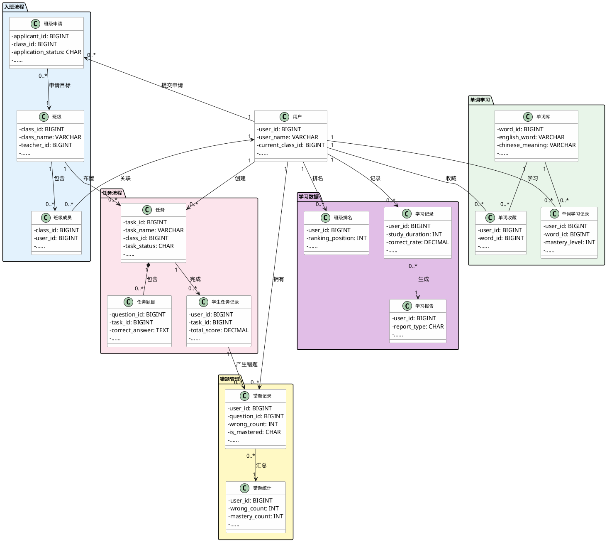

# 英语学习系统数据库类图关系说明

## 数据库 UML 类图（PlantUML）

```plantuml
@startuml 英语学习系统数据库类图
skinparam classAttributeIconSize 0
skinparam classFontSize 12
skinparam class {
  BackgroundColor #FEFEFE
  BorderColor #333333
  ArrowColor #333333
}

' ==================== 用户与角色 ====================
class sys_user as "用户" {
  - user_id: BIGINT
  - user_name: VARCHAR
  - nick_name: VARCHAR
  - password: VARCHAR
  - status: CHAR
  - current_class_id: BIGINT
  - user_level: INT
  - total_study_time: INT
  - ......
}

class sys_role as "角色" {
  - role_id: BIGINT
  - role_name: VARCHAR
  - role_key: VARCHAR
  - status: CHAR
  - ......
}

class sys_user_role as "用户角色关联" {
  - user_id: BIGINT
  - role_id: BIGINT
}

class elia_user_profile as "用户学习档案" {
  - profile_id: BIGINT
  - user_id: BIGINT
  - learning_style: VARCHAR
  - daily_goal: INT
  - auto_play_audio: CHAR
  - ......
}

' ==================== 班级管理 ====================
class elia_class as "班级" {
  - class_id: BIGINT
  - class_name: VARCHAR
  - class_code: VARCHAR
  - class_level: CHAR
  - teacher_id: BIGINT
  - max_students: INT
  - current_students: INT
  - class_status: CHAR
  - ......
}

class elia_class_member as "班级成员" {
  - member_id: BIGINT
  - class_id: BIGINT
  - user_id: BIGINT
  - member_role: CHAR
  - completed_tasks: INT
  - mastery_words: INT
  - class_rank: INT
  - ......
}

class elia_class_application as "班级申请记录" {
  - application_id: BIGINT
  - applicant_id: BIGINT
  - class_id: BIGINT
  - application_type: CHAR
  - application_status: CHAR
  - audit_by: BIGINT
  - ......
}

class elia_class_announcement as "班级公告" {
  - announcement_id: BIGINT
  - class_id: BIGINT
  - title: VARCHAR
  - content: TEXT
  - publisher_id: BIGINT
  - status: CHAR
  - ......
}

class elia_class_ranking as "班级排名" {
  - ranking_id: BIGINT
  - class_id: BIGINT
  - user_id: BIGINT
  - ranking_type: CHAR
  - ranking_value: DECIMAL
  - ranking_position: INT
  - ranking_date: DATE
  - ......
}

' ==================== 单词管理 ====================
class elia_word_library as "单词库" {
  - word_id: BIGINT
  - english_word: VARCHAR
  - phonetic_uk: VARCHAR
  - phonetic_us: VARCHAR
  - chinese_meaning: VARCHAR
  - word_type: VARCHAR
  - difficulty_level: INT
  - example_sentence: VARCHAR
  - ......
}

class elia_user_word_record as "用户单词学习记录" {
  - record_id: BIGINT
  - user_id: BIGINT
  - word_id: BIGINT
  - study_count: INT
  - correct_count: INT
  - wrong_count: INT
  - mastery_level: INT
  - is_mastered: CHAR
  - ......
}

class elia_word_collection as "单词收藏" {
  - collection_id: BIGINT
  - user_id: BIGINT
  - word_id: BIGINT
  - collection_group: VARCHAR
  - tags: VARCHAR
  - notes: TEXT
  - ......
}

class elia_word_search_log as "单词查询记录" {
  - log_id: BIGINT
  - user_id: BIGINT
  - search_word: VARCHAR
  - search_type: CHAR
  - search_result: TEXT
  - ......
}

' ==================== 任务管理 ====================
class elia_task as "任务" {
  - task_id: BIGINT
  - task_name: VARCHAR
  - task_type: CHAR
  - class_id: BIGINT
  - teacher_id: BIGINT
  - question_count: INT
  - total_score: DECIMAL
  - pass_score: DECIMAL
  - task_status: CHAR
  - ......
}

class elia_task_question as "任务题目" {
  - question_id: BIGINT
  - task_id: BIGINT
  - question_type: CHAR
  - question_content: TEXT
  - correct_answer: TEXT
  - score: DECIMAL
  - difficulty_level: INT
  - ......
}

class elia_student_task as "学生任务记录" {
  - record_id: BIGINT
  - user_id: BIGINT
  - task_id: BIGINT
  - class_id: BIGINT
  - total_score: DECIMAL
  - correct_count: INT
  - wrong_count: INT
  - task_status: CHAR
  - is_passed: CHAR
  - ......
}

class elia_task_reminder as "任务督促记录" {
  - reminder_id: BIGINT
  - task_id: BIGINT
  - reminder_type: CHAR
  - reminded_by: BIGINT
  - reminder_content: TEXT
  - reminder_status: VARCHAR
  - ......
}

' ==================== 错题管理 ====================
class elia_wrong_question as "错题记录" {
  - wrong_id: BIGINT
  - user_id: BIGINT
  - task_id: BIGINT
  - question_id: BIGINT
  - class_id: BIGINT
  - correct_answer: TEXT
  - student_answer: TEXT
  - wrong_count: INT
  - is_mastered: CHAR
  - ......
}

class elia_wrong_question_stat as "错题统计" {
  - stat_id: BIGINT
  - user_id: BIGINT
  - class_id: BIGINT
  - stat_date: DATE
  - question_type: CHAR
  - wrong_count: INT
  - total_count: INT
  - mastery_count: INT
  - ......
}

' ==================== 学习数据分析 ====================
class elia_learning_record as "学习记录" {
  - record_id: BIGINT
  - user_id: BIGINT
  - class_id: BIGINT
  - record_date: DATE
  - study_duration: INT
  - words_studied: INT
  - words_mastered: INT
  - correct_rate: DECIMAL
  - ......
}

class elia_learning_report as "学习分析报告" {
  - report_id: BIGINT
  - user_id: BIGINT
  - class_id: BIGINT
  - report_type: CHAR
  - report_date: DATE
  - strengths: TEXT
  - weaknesses: TEXT
  - suggestions: TEXT
  - ......
}

class elia_learning_config as "学习参数配置" {
  - config_id: BIGINT
  - config_key: VARCHAR
  - config_value: VARCHAR
  - config_group: VARCHAR
  - is_system: CHAR
  - ......
}

' ==================== 关系定义 ====================

' --- 用户与角色 (多对多) ---
sys_user "1" -- "0..*" sys_user_role
sys_role "1" -- "0..*" sys_user_role

' --- 用户与学习档案 (一对一) ---
sys_user "1" -- "1" elia_user_profile : 拥有

' --- 用户(教师)与班级 (一对多) ---
sys_user "1" -- "0..*" elia_class : 管理

' --- 班级与班级成员 (一对多) ---
elia_class "1" -- "0..*" elia_class_member : 包含
sys_user "1" -- "0..*" elia_class_member : 加入

' --- 班级申请 ---
sys_user "1" -- "0..*" elia_class_application : 提交
elia_class "1" -- "0..*" elia_class_application : 目标

' --- 班级公告 ---
elia_class "1" -- "0..*" elia_class_announcement : 发布
sys_user "1" -- "0..*" elia_class_announcement : 发布人

' --- 班级排名 ---
elia_class "1" -- "0..*" elia_class_ranking : 排名
sys_user "1" -- "0..*" elia_class_ranking : 参与

' --- 单词学习记录 (用户与单词多对多) ---
sys_user "1" -- "0..*" elia_user_word_record : 学习
elia_word_library "1" -- "0..*" elia_user_word_record : 被学习

' --- 单词收藏 (用户与单词多对多) ---
sys_user "1" -- "0..*" elia_word_collection : 收藏
elia_word_library "1" -- "0..*" elia_word_collection : 被收藏

' --- 单词查询记录 ---
sys_user "1" -- "0..*" elia_word_search_log : 查询

' --- 任务管理 ---
elia_class "1" -- "0..*" elia_task : 布置
sys_user "1" -- "0..*" elia_task : 创建
elia_task "1" *-- "0..*" elia_task_question : 包含

' --- 学生任务记录 (用户与任务多对多) ---
sys_user "1" -- "0..*" elia_student_task : 完成
elia_task "1" -- "0..*" elia_student_task : 被完成

' --- 任务督促 ---
elia_task "1" -- "0..*" elia_task_reminder : 督促

' --- 错题记录 ---
sys_user "1" -- "0..*" elia_wrong_question : 产生
elia_task "1" -- "0..*" elia_wrong_question : 来源
elia_task_question "1" -- "0..*" elia_wrong_question : 错题来源

' --- 错题统计 ---
sys_user "1" -- "0..*" elia_wrong_question_stat : 统计
elia_class "1" -- "0..*" elia_wrong_question_stat : 班级统计

' --- 学习记录 ---
sys_user "1" -- "0..*" elia_learning_record : 记录
elia_class "1" -- "0..*" elia_learning_record : 班级记录

' --- 学习报告 ---
sys_user "1" -- "0..*" elia_learning_report : 生成
elia_class "1" -- "0..*" elia_learning_report : 班级报告

@enduml
```

## 关系类型总结

### 一对一关系 (1:1)
- sys_user(用户) ←→ elia_user_profile(用户学习档案)

### 一对多关系 (1:N)
- sys_user(教师) → elia_class(班级)：一个教师管理多个班级
- elia_class(班级) → elia_class_member(班级成员)：一个班级有多个成员
- elia_class(班级) → elia_task(任务)：一个班级有多个任务
- elia_class(班级) → elia_class_announcement(班级公告)：一个班级有多个公告
- elia_class(班级) → elia_class_application(班级申请记录)：一个班级有多个申请
- elia_task(任务) → elia_task_question(任务题目)：一个任务包含多个题目（组合关系）
- elia_task(任务) → elia_task_reminder(任务督促记录)：一个任务有多个督促记录
- sys_user(用户) → elia_learning_record(学习记录)：一个用户有多个学习记录
- sys_user(用户) → elia_learning_report(学习分析报告)：一个用户有多个学习报告
- sys_user(用户) → elia_wrong_question(错题记录)：一个用户有多个错题
- sys_user(用户) → elia_word_search_log(单词查询记录)：一个用户有多个查询记录

### 多对多关系 (M:N) — 通过关联表实现
- sys_user(用户) ←→ sys_role(角色)：通过 sys_user_role
- sys_user(用户) ←→ elia_class(班级)：通过 elia_class_member(班级成员)
- sys_user(用户) ←→ elia_word_library(单词库)：通过 elia_user_word_record(用户单词学习记录)
- sys_user(用户) ←→ elia_word_library(单词库)：通过 elia_word_collection(单词收藏)
- sys_user(用户) ←→ elia_task(任务)：通过 elia_student_task(学生任务记录)

### 组合关系 (Composition)
- elia_task(任务) *-- elia_task_question(任务题目)：题目依赖任务存在

## 核心业务流程类图

