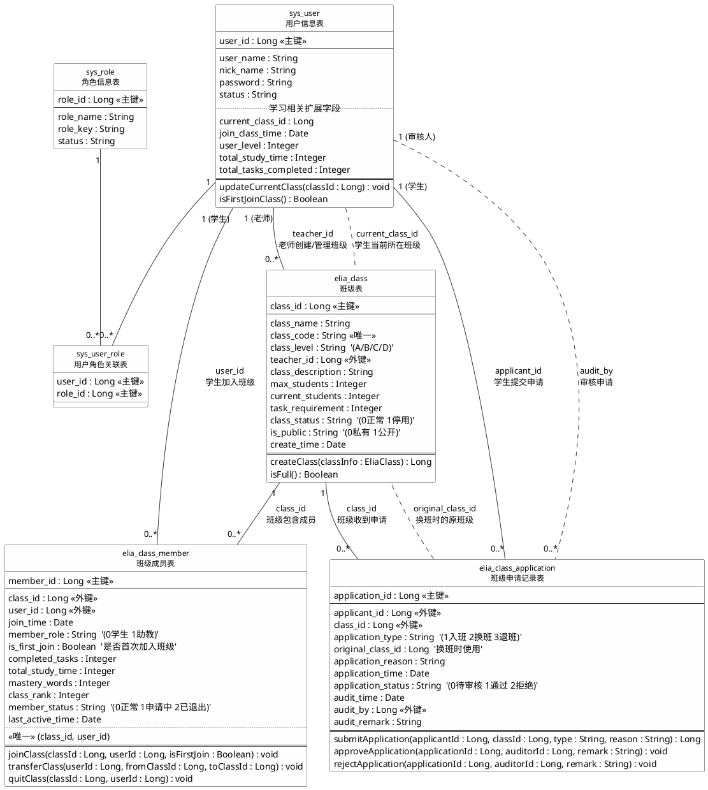
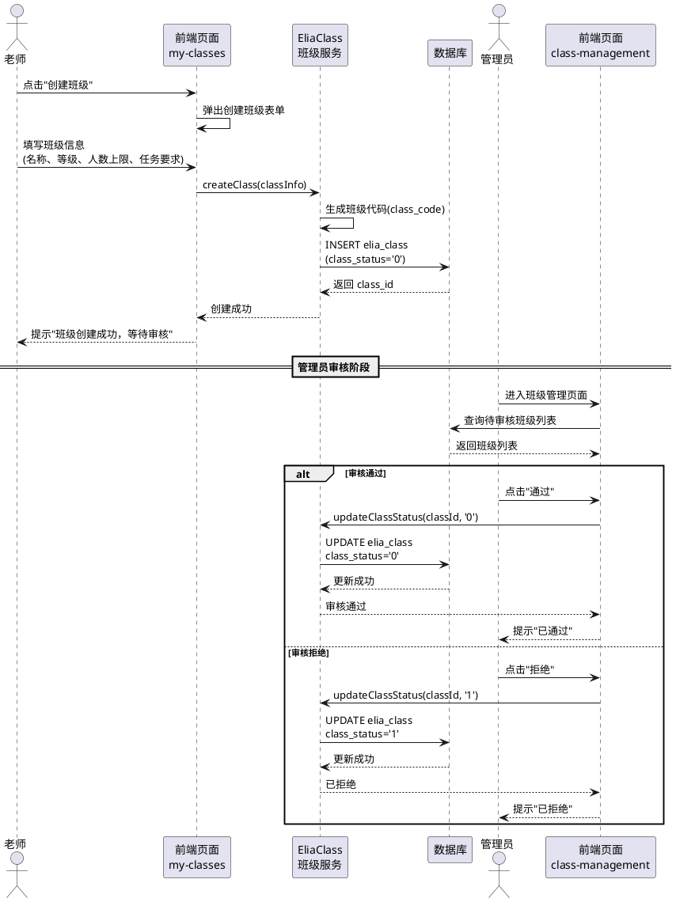
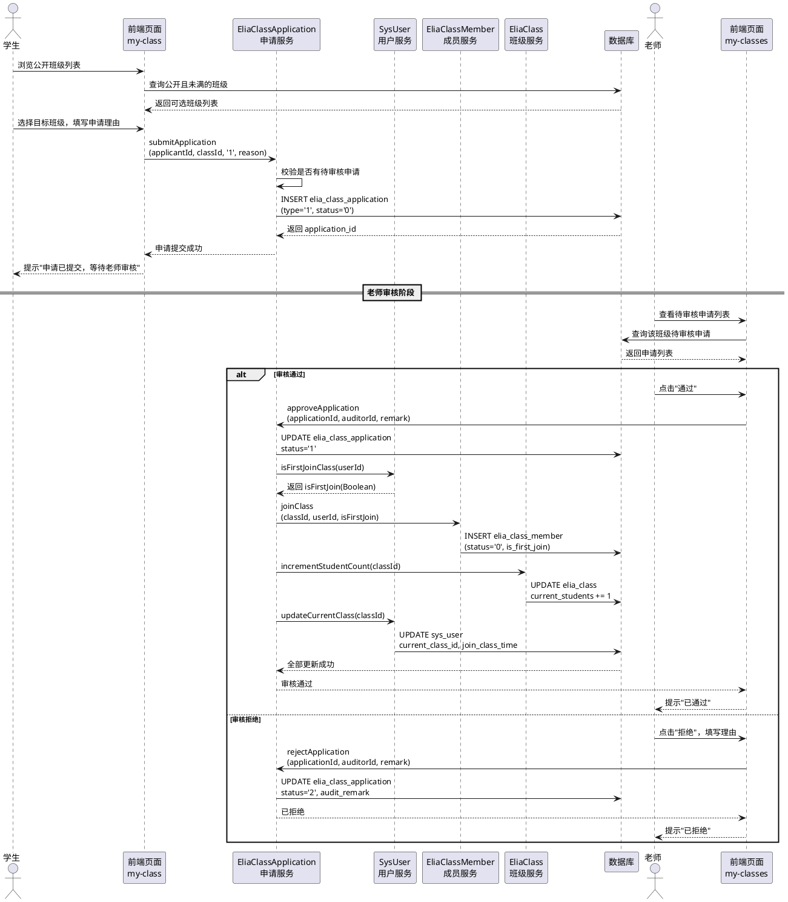
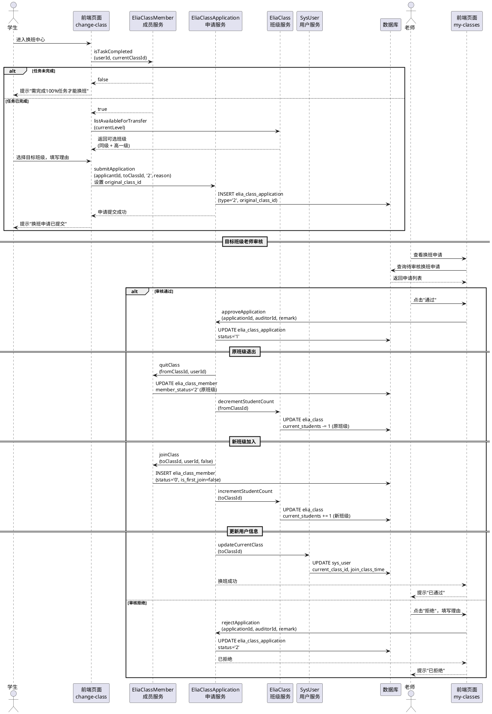
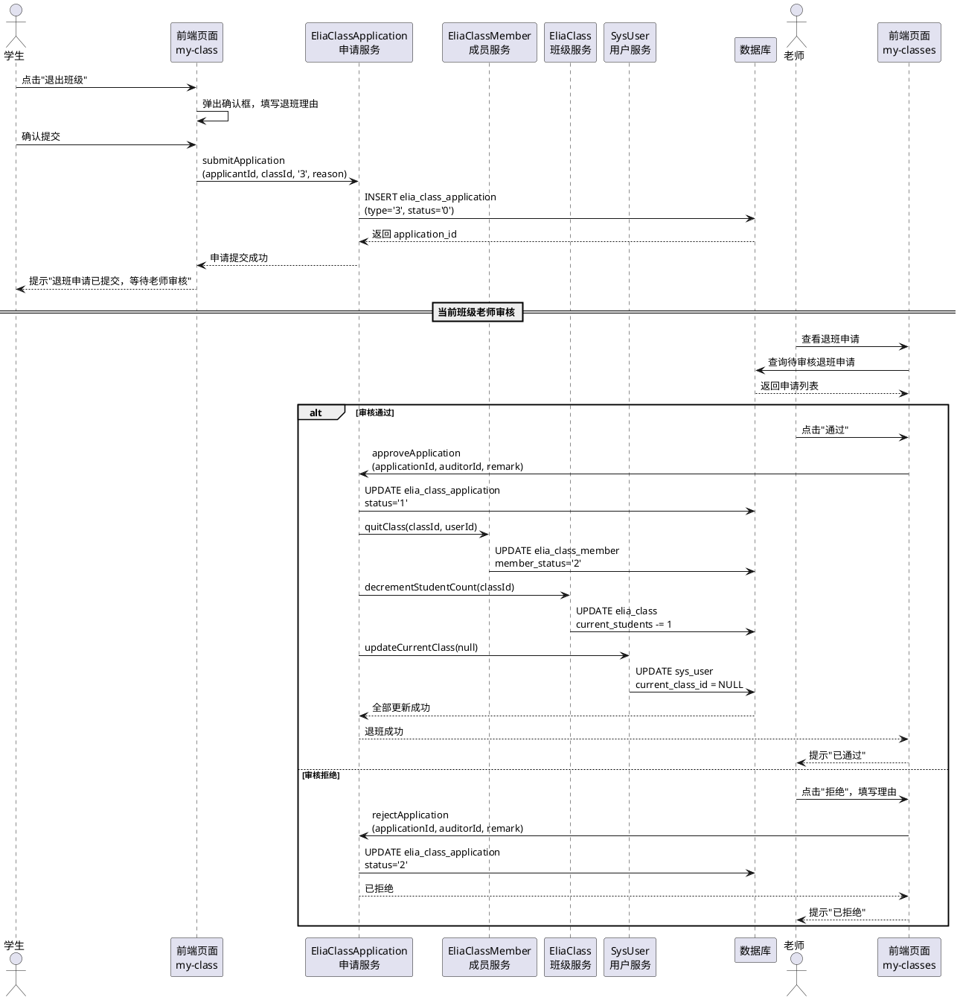

# 老师班级创建与学生班级流转 — 核心业务类图文档

## 一、业务场景概述

本文档聚焦于"老师创建班级"和"学生在班级间流转"这一核心业务场景，涵盖以下子流程：

1. 老师创建班级 → 管理员审核 → 班级生效
2. 学生申请入班 / 换班 / 退班 → 老师审核 → 成员变更
3. 班级成员状态管理与数据同步

---

## 二、涉及的数据库表

本业务场景直接涉及 **5 张核心表** 和 **1 张辅助表**：

| 序号 | 表名 | 中文名 | 在本场景中的角色 |
|------|------|--------|-----------------|
| 1 | `sys_user` | 用户信息表 | 老师（创建班级）、学生（申请入班/换班）、管理员（审核班级） |
| 2 | `elia_class` | 班级表 | 班级实体，记录班级基本信息、等级、容量、所属老师 |
| 3 | `elia_class_member` | 班级成员表 | 学生与班级的关联关系，记录成员状态和学习数据 |
| 4 | `elia_class_application` | 班级申请记录表 | 入班/换班/退班申请的全生命周期记录 |
| 5 | `sys_role` | 角色信息表 | 区分用户角色（学生/老师/管理员） |
| 6 | `sys_user_role` | 用户角色关联表 | 用户与角色的多对多映射 |

---

## 三、表关系详细说明

### 3.1 核心关系总览

```
sys_user (老师) ──1:N──→ elia_class (班级)           老师创建/管理多个班级
sys_user (学生) ──1:N──→ elia_class_application       学生提交多次申请
elia_class      ──1:N──→ elia_class_application       一个班级收到多个申请
elia_class      ──1:N──→ elia_class_member             一个班级有多个成员
sys_user (学生) ──1:N──→ elia_class_member             一个学生可存在于多条成员记录（历史）
sys_user        ──M:N──→ sys_role                      通过 sys_user_role 关联
```

### 3.2 各表关系逐一说明

#### （1）sys_user → elia_class（一对多）

- 关联字段：`elia_class.teacher_id` → `sys_user.user_id`
- 含义：一个老师可以创建并管理多个班级，每个班级只属于一个老师
- 业务约束：
  - 只有角色为"老师"的用户才能出现在 `teacher_id` 中
  - 老师创建班级后，班级的 `class_status` 初始为 `'0'`（正常），需管理员审核通过后才对学生可见

#### （2）elia_class → elia_class_member（一对多）

- 关联字段：`elia_class_member.class_id` → `elia_class.class_id`
- 唯一约束：`uk_class_user(class_id, user_id)` — 同一班级中同一用户只有一条成员记录
- 含义：一个班级包含多个成员（学生）
- 业务约束：
  - `current_students` 不能超过 `max_students`
  - 成员加入时 `elia_class.current_students` 需 +1，退出时 -1

#### （3）sys_user → elia_class_member（一对多）

- 关联字段：`elia_class_member.user_id` → `sys_user.user_id`
- 含义：一个学生可以有多条成员记录（当前班级 + 历史退出记录）
- 业务约束：
  - 同一时间，一个学生只能在一个班级中处于 `member_status = '0'`（正常）状态
  - `sys_user.current_class_id` 始终指向学生当前所在班级

#### （4）sys_user → elia_class_application（一对多）

- 关联字段：`elia_class_application.applicant_id` → `sys_user.user_id`
- 含义：一个学生可以提交多次班级申请
- 业务约束：
  - 同一学生对同一班级同一时间只能有一条 `application_status = '0'`（待审核）的申请
  - `application_type` 区分三种申请：`'1'` 入班、`'2'` 换班、`'3'` 退班

#### （5）elia_class → elia_class_application（一对多）

- 关联字段：`elia_class_application.class_id` → `elia_class.class_id`
- 含义：一个班级可以收到多个入班/换班申请
- 补充：换班申请中 `original_class_id` 记录学生的原班级 ID

#### （6）elia_class_application.audit_by → sys_user.user_id

- 含义：审核人（老师或管理员）的用户 ID
- 业务约束：入班/换班申请由目标班级的老师审核，退班申请由当前班级老师审核

---

## 四、PlantUML 类图



---

### 4.1 类图涉及的设计类说明

在本业务场景的类图中，涉及到用户类、角色类、用户角色关联类、班级类、班级成员类和班级申请记录类。这六个类所具备的主要属性和方法如下：

用户类（SysUser）：用户ID、用户账号、用户昵称、密码、账号状态、当前班级ID、加入班级时间、用户等级、总学习时长、总完成任务数。用户类提供更新当前班级和判断是否首次加入班级等功能。

角色类（SysRole）：角色ID、角色名称、角色权限字符串、角色状态。角色类用于区分系统中的学生、老师和管理员三种角色身份。

用户角色关联类（SysUserRole）：用户ID、角色ID。该类作为用户与角色之间多对多关系的中间表，记录每个用户所拥有的角色。

班级类（EliaClass）：班级ID、班级名称、班级代码、班级等级（A/B/C/D）、教师ID、班级描述、最大学生数、当前学生数、任务完成要求数量、班级状态（正常/停用）、是否公开、创建时间。班级类提供老师创建班级和判断班级是否已满员等功能。

班级成员类（EliaClassMember）：成员ID、班级ID、用户ID、加入时间、成员角色（学生/助教）、是否首次加入班级（Boolean）、已完成任务数、总学习时长、掌握单词数、班级排名、成员状态（正常/申请中/已退出）、最后活跃时间。班级成员类提供学生加入班级、学生转班和学生退班三个核心功能。

班级申请记录类（EliaClassApplication）：申请ID、申请人ID、班级ID、申请类型（入班/换班/退班）、原班级ID（换班时使用）、申请理由、申请时间、申请状态（待审核/通过/拒绝）、审核时间、审核人ID、审核备注。班级申请记录类提供学生提交申请、老师审核通过申请和老师审核拒绝申请等功能。

---

## 五、业务流转状态机

### 5.1 班级创建流程

```
老师填写班级信息 → 提交创建
       ↓
  elia_class 新增记录
  class_status = '0' (正常)
       ↓
  管理员在 class-management 页面审核
       ↓
  ┌─ 通过 → class_status 保持 '0'，班级对学生可见
  └─ 拒绝 → class_status 设为 '1'（停用）或删除记录
```

涉及字段变更：

| 操作 | 表 | 字段变更 |
|------|----|---------|
| 老师创建班级 | `elia_class` | INSERT：class_name, class_code, class_level, teacher_id, max_students, task_requirement |
| 管理员通过 | `elia_class` | UPDATE：class_status → '0' |
| 管理员拒绝 | `elia_class` | UPDATE：class_status → '1' 或 DELETE |

### 5.2 学生入班流程

```
学生浏览公开班级列表 → 选择班级 → 提交入班申请
       ↓
  elia_class_application 新增记录
  application_type = '1', application_status = '0'
       ↓
  目标班级老师审核
       ↓
  ┌─ 通过 →
  │    ① elia_class_application.application_status → '1'
  │    ② elia_class_member INSERT（member_status = '0'）
  │    ③ elia_class.current_students += 1
  │    ④ sys_user.current_class_id → 目标 class_id
  │    ⑤ sys_user.join_class_time → 当前时间
  │
  └─ 拒绝 →
       ① elia_class_application.application_status → '2'
       ② elia_class_application.audit_remark 填写拒绝理由
```

### 5.3 学生换班流程

前置条件：学生在当前班级的任务完成率达到 100%（`completed_tasks >= task_requirement`）

```
学生进入换班中心 → 系统校验任务完成率
       ↓
  ┌─ 未达标 → 提示"完成全部任务后才能换班"
  └─ 已达标 → 展示可选班级（同级 + 高一级）
       ↓
  选择目标班级 → 填写申请理由 → 提交换班申请
       ↓
  elia_class_application 新增记录
  application_type = '2', original_class_id = 当前班级ID
       ↓
  目标班级老师审核
       ↓
  ┌─ 通过 →
  │    ① elia_class_application.application_status → '1'
  │    ② 原班级 elia_class_member.member_status → '2'（已退出）
  │    ③ 原班级 elia_class.current_students -= 1
  │    ④ 目标班级 elia_class_member INSERT（member_status = '0'）
  │    ⑤ 目标班级 elia_class.current_students += 1
  │    ⑥ sys_user.current_class_id → 目标 class_id
  │    ⑦ sys_user.join_class_time → 当前时间
  │
  └─ 拒绝 →
       ① elia_class_application.application_status → '2'
       ② 学生留在原班级，状态不变
```

换班等级规则（来自前端 `change-class.vue`）：

| 当前等级 | 可换到的等级 |
|---------|------------|
| D | D、C |
| C | D、C、B |
| B | D、C、B、A |
| A | D、C、B、A |

即：可以换到同级、低级、或高一级的班级。

### 5.4 学生退班流程

```
学生提交退班申请
       ↓
  elia_class_application 新增记录
  application_type = '3', application_status = '0'
       ↓
  当前班级老师审核
       ↓
  ┌─ 通过 →
  │    ① elia_class_application.application_status → '1'
  │    ② elia_class_member.member_status → '2'（已退出）
  │    ③ elia_class.current_students -= 1
  │    ④ sys_user.current_class_id → NULL
  │
  └─ 拒绝 →
       ① elia_class_application.application_status → '2'
```

---

## 六、关键索引与约束说明

| 表 | 索引/约束 | 说明 |
|----|----------|------|
| `elia_class` | `uk_class_code(class_code)` | 班级代码唯一，防止重复创建 |
| `elia_class` | `idx_teacher_level(teacher_id, class_level)` | 快速查询某老师某等级下的班级 |
| `elia_class` | `idx_class_status(class_status)` | 按状态筛选班级 |
| `elia_class_member` | `uk_class_user(class_id, user_id)` | 同一班级同一用户只有一条记录 |
| `elia_class_member` | `idx_user_status(user_id, member_status)` | 快速查询用户在各班级的状态 |
| `elia_class_application` | `idx_applicant_status(applicant_id, application_status)` | 查询某学生的申请列表 |
| `elia_class_application` | `idx_class_type(class_id, application_type)` | 查询某班级收到的各类申请 |

---

## 七、数据一致性要点

1. 换班操作需要在事务中完成：原班级退出 + 新班级加入 + 两个班级的 `current_students` 更新 + `sys_user.current_class_id` 更新，必须保证原子性。
2. `elia_class.current_students` 是冗余计数字段，需与 `elia_class_member` 中 `member_status = '0'` 的记录数保持一致。
3. `sys_user.current_class_id` 是快捷引用字段，需与 `elia_class_member` 中该用户 `member_status = '0'` 的记录保持一致。
4. 换班申请通过后，学生在原班级的学习数据（`completed_tasks`、`mastery_words` 等）保留在原 `elia_class_member` 记录中，新班级的成员记录从零开始。

---

## 八、时序图

本节针对四个核心业务场景分别绘制时序图，展示各参与者（角色）与系统对象之间的消息交互顺序。

### 8.1 老师创建班级时序图



#### 执行逻辑描述

（1）老师在"我的班级"页面点击"创建班级"按钮，系统弹出创建表单。

（2）老师填写班级名称、班级等级（A/B/C/D）、班级限定人数（30-50）、任务完成要求数量（60-100）等信息后提交。

（3）前端调用 EliaClass 班级服务的 createClass 方法，服务层自动生成唯一的班级代码，然后向数据库 elia_class 表插入一条新记录，班级状态初始为"0"（正常）。

（4）管理员登录后进入班级管理页面，查看待审核的班级列表。管理员查看班级详情后做出审核决策：若通过，班级状态保持"0"，班级对学生可见；若拒绝，班级状态更新为"1"（停用）。

---

### 8.2 学生加入班级时序图



#### 执行逻辑描述

（1）学生在"我的班级"页面浏览系统中公开且未满员的班级列表，选择目标班级并填写申请理由。

（2）前端调用申请服务的 submitApplication 方法，传入申请类型为"1"（入班）。服务层先校验该学生是否已有对该班级的待审核申请，若无则向 elia_class_application 表插入一条新记录。

（3）目标班级的老师在"我的班级"页面查看待审核申请列表，点击查看申请详情。

（4）若老师审核通过：系统先更新申请状态为"1"（通过），然后调用用户服务的 isFirstJoinClass 方法判断该学生是否首次加入班级（返回 Boolean），接着调用成员服务的 joinClass 方法向 elia_class_member 表插入一条新成员记录并写入 is_first_join 标识，同时更新班级的 current_students 计数加 1，最后更新 sys_user 表的 current_class_id 和 join_class_time。

（5）若老师审核拒绝：更新申请状态为"2"（拒绝），写入审核备注。

---

### 8.3 学生转班时序图



#### 执行逻辑描述

（1）学生进入换班中心页面，系统首先调用成员服务的 isTaskCompleted 方法校验该学生在当前班级的任务完成率是否达到 100%。若未达标，页面直接提示"需完成全部任务才能换班"，不展示可选班级。

（2）若任务已全部完成，系统调用班级服务的 listAvailableForTransfer 方法，根据当前班级等级查询可选班级（同级、低级、或高一级），返回给前端展示。

（3）学生选择目标班级并填写申请理由后提交。前端调用申请服务的 submitApplication 方法，申请类型为"2"（换班），同时记录 original_class_id 为当前班级 ID。

（4）目标班级的老师查看换班申请列表并审核。若通过，系统在一个事务中依次执行以下操作：更新申请状态为通过；将原班级的成员记录状态改为"2"（已退出）；原班级 current_students 减 1；向新班级插入一条成员记录（is_first_join 为 false，因为不是首次加入班级）；新班级 current_students 加 1；更新 sys_user 的 current_class_id 指向新班级。

（5）若老师拒绝，仅更新申请状态为"2"（拒绝），学生留在原班级不变。

---

### 8.4 学生退班时序图



#### 执行逻辑描述

（1）学生在"我的班级"页面点击"退出班级"按钮，系统弹出确认框要求填写退班理由。

（2）学生确认后，前端调用申请服务的 submitApplication 方法，申请类型为"3"（退班），向 elia_class_application 表插入一条待审核记录。

（3）当前班级的老师在"我的班级"页面查看退班申请列表并审核。

（4）若老师审核通过：系统更新申请状态为"1"（通过），调用成员服务的 quitClass 方法将该学生的成员状态改为"2"（已退出），班级的 current_students 减 1，同时将 sys_user 表的 current_class_id 置为 NULL，表示该学生当前不属于任何班级。

（5）若老师审核拒绝：仅更新申请状态为"2"（拒绝），学生仍留在当前班级。
